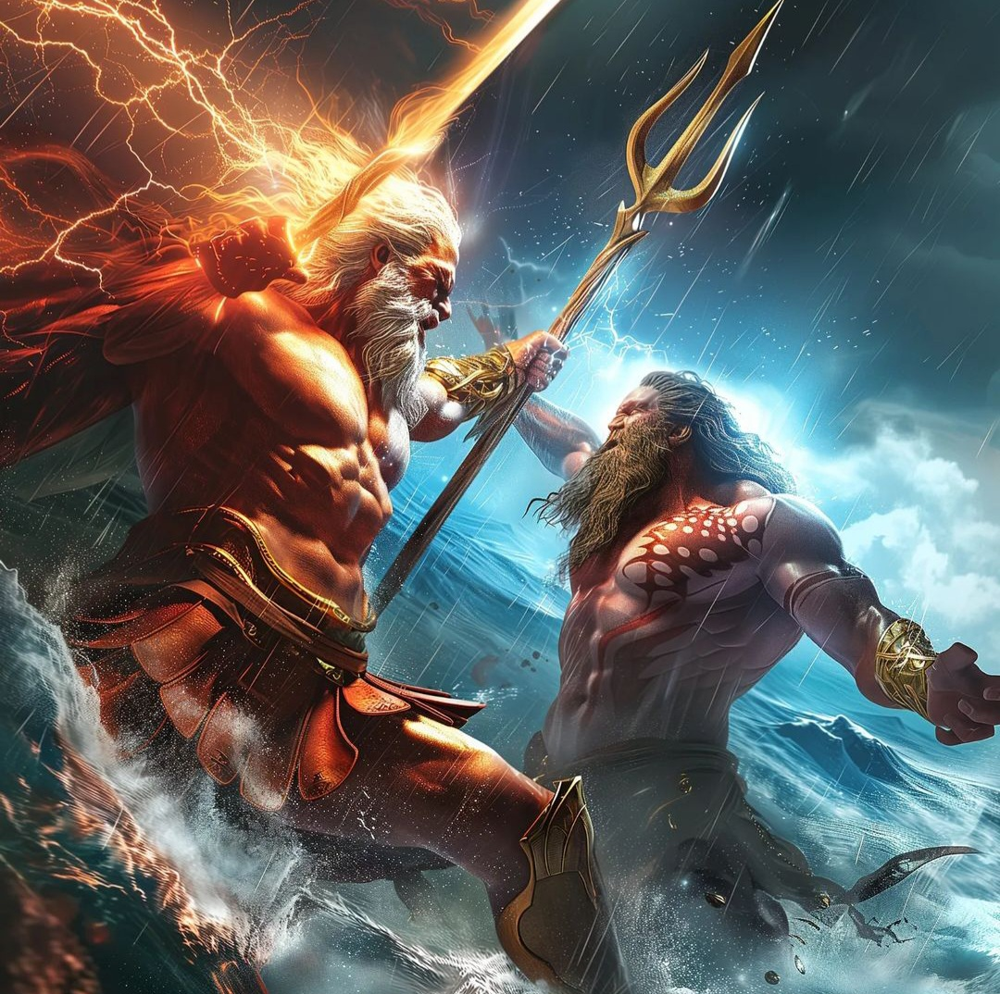

# Thần Thoại Hy Lạp

### Nguồn gốc của thế gian và của các vị thần

 

Thuở xưa, trước buổi khai thiên lập địa, trước khi có thế gian và các vị thần, lúc đó chỉ có Chaos. Đó là một vực thẳm đen ngòm, vô cùng vô tận, trống rỗng, mơ hồ, vật vờ, phiêu bạt trong khoảng không gian bao la.

Thoạt đầu là Chaos một vực thẳm vô cùng

Hung dữ như biển khơi, tối đen, lang thang, hoang dã.

Nhà thơ Milton, người Anh, thế kỷ XVII đã diễn đạt lại quan niệm của người Hy Lạp cổ về khởi nguyên của thế gian và các vị thần bằng hai câu thơ như thế.

Nhưng rồi từ Chaos đã nẩy sinh ra thế gian với bao điều kỳ lạ cùng với các vị thần có một cuộc sống phong phú khác thường. Từ Chaos đã ra đời Gaia, Đất mẹ của muôn loài, có bộ ngực mênh mông. Chính Đất mẹ-Gaia là nơi sinh cơ lập nghiệp bền vững đời đời của muôn vàn sinh linh, vạn vật.

Chaos lại sinh ra Érèbe-Chốn Tối tăm Vĩnh cửu và Nyx-Đêm tối Mịt mù. Nhưng chưa hết, từ Chaos lại ra đời Tartare-Địa ngục và Éros-Tình yêu. Éros là đứa con cuối cùng của Chaos nhưng lại là đứa con xinh đẹp nhất. Éros ra đời lãnh sứ mạng làm cho thần thần, người người, cỏ cây hoa lá, vạn vật muôn loài giao hòa gắn bó với nhau để tạo nên thế gian và cuộc sống vĩnh hằng bất diệt.

Như vậy là Chaos sinh ra năm “người con”. Với “năm người” này (ngày nay chúng ta gọi là nguyên lý) sẽ sinh sôi nảy nở ra con đàn cháu đống nối dõi đời đời.

Érèbe-Chốn Tối tăm Vĩnh cửu lấy Nyx-Đêm tối Mịt mù làm vợ. Họ sinh được hai người con: anh là Khí-Éther bất diệt, em là Ánh sáng trong trẻo-Héméra; Ngày-Jour ra đời từ ánh sáng này. Kể từ đó thế gian tràn ngập ánh sáng. Ngày và Đêm thay nhau ngự trị.

Nữ thần Đất mẹ-Gaia có bộ ngực nở nang tràn đầy sức sống. Đứa con đầu lòng của nàng là Ouranos-Bầu trời sao nhấp nhánh. Nhà thơ Hy Lạp Hésiode sống vào quãng thế kỷ VIII hoặc VII TCN, kể lại trong tập Thần hệ (Théogonie):

Nữ thần Đất có bộ ngực nở nang

Đối với mọi vật nàng là móng nền vững chắc

Nàng Đất tóc vàng sinh cho thế gian trước hết

Bầu trời sao nhấp nhánh, bạn thân thiết của nàng

Để Bầu trời che phủ khắp thế gian,

Để làm nơi cư ngụ cho các vị thần Cực lạc.

Nàng lại còn đẻ ra Núi-Ouréa cao vút, sừng sững, nghênh ngang và Biển-Pontos mênh mông, khi hung dữ gầm thét, lúc hiền dịu rì rào. Trời, Núi, Biển như vậy đều do nữ thần Đất mẹ-Gaia sinh ra. Chúng là những đứa con không cha, bởi vì khi ấy mẹ chúng chưa cùng ai kết bạn. Đối với thần thì điều ấy chẳng có gì đáng lạ.

Tiếp đó, nữ thần Đất-Gaia kết hôn với thần Bầu Trời-Ouranos. Hai người sinh ra được rất nhiều con. Chúng toàn là những người khổng lồ có sức mạnh và tài năng mà thuở ấy chưa có vị thần nào ra đời để có thể sánh bằng. Tất nhiên, sau này chúng phải quy phục trước các vị thần mới. Người ta chia những đứa con khổng lồ của Ouranos và Gaia ra làm ba loại:

1 - Những thần khổng lồ Titan và Titanide - Có sáu nam thần khổng lồ tên gọi chung là Titan và sáu nữ thần khổng lồ tên gọi chung là Titanide.

Sáu Titan là: Okéanos tức thần Đại dương, Koios, Crios, Hypérion, Japet và Cronos (thần thoại La Mã: Saturne).

Sáu Titanide là: Téthys, Théia, Thémis, Mnémosyne, Phoébé và Rhéa.

2 - Ba thần khổng lồ Cyclopes - Đây là những vị thần chỉ có một con mắt ở giữa trán, hung bạo khỏe mạnh chẳng kém một ai, hơn nữa lại rất khéo chân khéo tay. Họ là những người thợ rèn thiện nghệ đã làm ra không thiếu một thứ gì. Tên ba anh em là: Argès, Stéropès và Brontès.

3. Ba quỷ thần khổng lồ Hécatonchires - Những Cyclopes đã thật là quái đản nhưng những Hécatonchires lại còn quái đản hơn nhiều. Mỗi Hécatonchires có một trăm cái tay và năm chục cái đầu. Người ta thường gọi chúng là thần Trăm tay. Sức mạnh của chúng thật kinh thiên động địa, ít ai dám nghĩ đến, chỉ nghĩ đến thôi, việc đọ sức với chúng. Tên chúng là Cottos, Briarée và Gyès.

***

Như trên đã kể, Ouranos lấy Gaia làm vợ sinh được sáu trai gọi chung là Titan, sáu gái tên gọi chung là Titanide. Các Titan kết hôn với các Titanide sinh con đẻ cái để cho chúng cai quản thế gian.

Titan đầu tiên, con cả, là thần Okéanos. Thần cai quản mọi biển khơi, suối nguồn, sông nước. Thần đã điều hòa, sắp xếp biển, sông làm thành một con sông khổng lồ bao quanh lấy đất, che chở cho đất. Okéanos lấy Téthys đẻ ra ba nghìn trai, ba nghìn gái. Gái có tên chung là Okéanide. Đó là những tiên nữ thường trú ngụ ở dưới biển nhưng cũng ở cả sông, suối. Con trai là các thần sông cai quản mọi sông cái, sông con trên mặt đất.

Okéanos sống cách biệt với các anh em Titan của mình ở tận cung điện dưới đáy biển sâu. Chẳng bao giờ vị thần này tham dự các cuộc họp của thần thánh và loài người. Mặt trời, Mặt trăng và các Ngôi sao đều do Okéanos điều khiển. Chúng phải xuất hiện với thế gian rồi trở về với Okéanos. Duy chỉ có chòm sao Đại Hùng-Gande Ourse là không bao giờ chịu quy phục dưới quyền điều khiển của Okéanos.

Titan Koios lấy Phoébé sinh được hai con gái là Léto và Astéria. Sắc đẹp của hai chị em nhà này đã gây ra cho họ biết bao đau khổ, gian truân, một chuyện nếu kể ra ắt phải đụng đến thần Zeus.

Titan Hypérion lấy nữ thần Théia. Đôi vợ chồng này sinh được một trai, hai gái. Trai là Hélios-Thần Mặt trời đỏ rực, gái là Séléné-Nữ thần Mặt trăng hiền dịu và Éos-Nữ thần Rạng đông hay Bình minh có những ngón tay hồng.

Titan Cronos mà thần thoại La Mã gọi là Saturne lấy Rhéa sinh được ba trai, ba gái: trai là Hadès, Poséidon, Zeus; gái là Hestia, Déméter, Héra.

Riêng hai Titanide Thémis và Mnémosyne lúc này chưa chịu kết bạn với ai. Duyên cớ vì sao, người xưa không kể lại nên chúng ta không rõ. Vì thế hai Titan Koios và Japet phải lấy hai vị nữ thần khác không cùng huyết thống Titan.

Crios lấy Eurybie sinh được ba trai là các vị thần Astréos, Pallas và Persès, nổi danh lừng lẫy vì sự hiểu biết uyên thâm. Nhân đây ta cần phải kể qua cuộc tình duyên của người con cả của Titan Koios, thần Astréos. Thần lấy tiên nữ Éos-Rạng Đông có những ngón tay hồng, sinh ra cho thế gian các thần Gió hung dữ. Tuy vậy, thần Gió-Zéphyr (thần thoại La Mã: Favonius) tính khí lại rất dịu dàng. Thần đến với thế gian bằng những cử chỉ vuốt ve, âu yếm, đem đến cho loài người những đám mây đen báo trước những cơn mưa mát dạ mát lòng. Chúng ta thường gọi Zéphyr là thần Gió Tây. Còn thần Gió Bấc-Borée (thần thoại La Mã: Septentrion) có bước đi nhanh, ít thần Gió nào sánh kịp, vì thế thần đem đến cho loài người không ít lo âu. Thần Gió Nam-Notos (thần thoại La Mã: Auster) ấm áp. Thần Gió Tây Nam-Euros (thần thoại La Mã: Vulturnus) mát mẻ, dịu dàng. Cả đến những ngôi sao hằng hà sa số thao thức vằng vặc suốt đêm trên bầu trời bao la cũng là con của Astréos và Éos.

Cũng cần phải kể thêm một chút nữa là Éos còn có nhiều cuộc tình duyên với các vị thần khác và cả với người trần để sinh con đẻ cháu cho thế gian đông đúc vui tươi.

Titan Japet lấy một tiên nữ Okéanide tên là Clymène. Họ sinh được bốn con trai là: Atlas, Prométhée, Epiméthée, và Ménétios.

Thế còn hai Titanide Thémis và Mnémosyne không “lấy chồng” thì làm gì? Xin thưa, thế giới thần thánh xưa kia không để cho ai ăn không ngồi rồi cả. Ai ai cũng có những công việc phải làm tròn. Thémis là vị nữ thần Pháp luật, Công lý, sự Cân bằng, Ổn định tối cao do Quy luật và Trật tự tạo nên. Nhờ có Thémis thế gian mới ổn định và phát triển hài hòa. Nàng là người có tài nhìn xa trông rộng, hiểu biết, khôn ngoan. Còn Mnémosyne là nữ thần của Trí nhớ, Ký ức. Nhờ có Mnémosyne mà con người lưu giữ được kinh nghiệm và sự hiểu biết để ngày càng khôn lớn, giỏi giang.

Đó là chuyện về lớp con đầu của Ouranos và Gaia, những Titan và Titanide cùng đôi chút về con cháu họ. Tất nhiên nếu lần theo tộc phả từng chi, từng ngành thì còn biết bao nhiêu chuyện.

Về nguồn gốc của thế gian còn có một cách kể hơi khác một chút. Nhà viết hài kịch cổ đại Hy Lạp, Aristophane thế kỷ V TCN viết:

Đêm tối có đôi cánh đen

Đem một quả trứng sinh ra từ gió

Đặt vào lòng Érèbe tối đen, sâu thẳm, mịt mù

Và trong khi bốn mùa thay nhau qua lại

Thì cả không gian hằng hằng mong đợi

Thần Tình yêu đến với đôi cánh vàng ngời ngợi chói lòa.

Cách giải thích này rõ ràng không giống với câu chuyện vừa kể trên. Đó là cách giải thích theo quan niệm của học thuyết thần thoại tôn giáo Orphisme, một học thuyết ra đời muộn hơn, vào quãng thế kỷ VIII TCN.

... Thuở xưa, trước buổi khai thiên lập địa chỉ có Chaos. Chaos là một vực thẳm trống rỗng, tối tăm nảy sinh từ Thời gian Vĩnh viễn-Chronos. Lửa, Nước, Không khí cũng từ Chronos mà ra, và nhờ có chúng các vị thần mới có thể kế tiếp nhau ra đời hết thế hệ này đến thế hệ khác.

Đêm tối-Nyx và Sương mù đều cư ngụ trong lòng Chronos. Sương mù kết đọng lại thành một quả trứng khổng lồ. Và đã có trứng thể tất có ngày trứng phải nở.

Quả trứng đã nở ra một vị thiên thần tươi trẻ, xinh đẹp có đôi cánh vàng. Vừa ra khỏi vỏ trứng vị thần này liền lấy hai tay dâng một nửa vỏ trứng lên cao và đạp nửa vỏ sau xuống dưới chân mình. Thế là Trời-Ouranos và Đất-Gaia hình thành. Còn vị thiên thần tươi trẻ xinh đẹp là thần Tình yêu-Éros. Éros là một vị thần có quyền lực đặc biệt; thần có tài làm cho vạn vật muôn loài, từ các vị thần cho đến con người, súc vật, cỏ cây hoa lá, thậm chí cả núi non sông biển giao hòa gắn bó với nhau. Thần đã gom góp, kết hợp mọi vật ở thế gian này để tạo ra cuộc sống. Mà quả thật như vậy, nếu như Trời và Đất không “âu yếm” nhau thì tại sao Trời không xa nổi Đất? Tại sao Trời không bỏ Đất mà đi để mặc Đất sống cô đơn, trơ trọi một mình, không ai che chở trong cõi Hư không tối tăm lạnh lẽo? Chính vì Trời đã “âu yếm” Đất nên đã chiếu rọi xuống Đất ánh sáng và khí nóng, đã tưới tắm cho Đất những cơn mưa ẩm mát để cho mùa màng tươi tốt, hoa thắm cỏ xanh. Còn Đất, để đền đáp lại tình yêu của Trời, tình yêu của Éros ban cho, Đất đã thai nghén ấp ủ trong lòng những hạt giống và làm cho chúng nảy mầm đâm nhánh. Đất đã truyền đi nhựa sống của mình nuôi cỏ hoa cây cối. Và có phải để “làm dáng” với Trời mà Đất luôn luôn thay đổi y phục và đồ trang sức, khi thì xanh xanh bát ngát, khi thì vàng rượi óng chuốt một màu? Lại có lúc Trời bận việc đi xa để Đất nhớ, nhớ đến héo hon, ủ rũ, âu sầu!