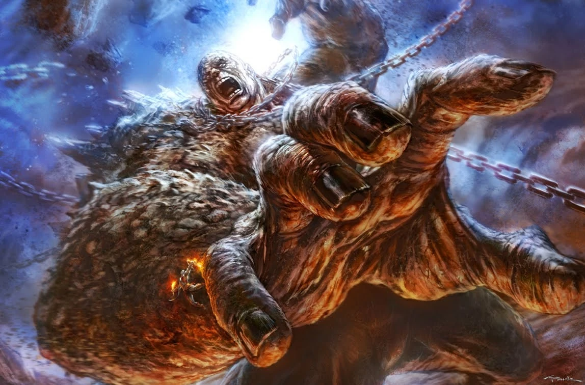

# Thần Thoại Hy Lạp

### Cronos lật đổ Ouranos

Ouranos và Gaia, như trên đã kể, sinh ra ba loại con khổng lồ. Đối với những đứa con Cyclopes và Hécatonchires, Ouranos rất ghét. Hình như Ouranos thấy sự có mặt của chúng là một điều ô nhục đối với mình. Thần nghĩ ra một cách để tống chúng đi cho khuất mắt: đầy chúng xuống địa ngục Tratar, nơi sâu thẳm kiệt cùng dưới lòng đất.

Nữ thần Gaia hoàn toàn không bằng lòng với chồng về cách đối xử với lũ con Cyclopes và Hécatonchires của bà như vậy. Bà tìm đến đám con Titan, xui giục các Titan chống lại bố. Nhưng chẳng một Titan nào dám nghe theo lời mẹ. Duy chỉ có Titan Cronos là dám đảm nhận công việc tày đình ấy. Theo mưu kế của mẹ, được mẹ giao cho một lưỡi hái, Cronos rình nấp chờ lúc Ouranos vào giường ngủ, chém chết Ouranos

Titan Cronos

Máu của Ouranos-Trời chảy xuống Gaia-Đất sinh ra một thế hệ khổng lồ thứ tư mà so với các Cyclopes và Hécatonchires, thế hệ này nếu không hơn thì cũng chẳng hề mảy may thua kém. Đây là những khổng lồ Gigantos có thể gọi là Đại khổng lồ, thân hình cao lớn, khiên giáp sáng ngời, trong tay lúc nào cũng lăm lăm ngọn lao dài nhọn hoắt, mặt mày dữ tợn gớm ghiếc.

Máu của Ouranos còn sinh ra những nữ thần Érinyes (thần thoại La Mã: Furies) tay cầm roi, tay cầm đuốc, mái tóc là một búi rắn độc ngoằn ngoèo vươn đầu ra tua tủa, ai trông thấy cũng phải cao chạy xa bay. Những nữ thần này lãnh sứ mạng trừng phạt báo thù kẻ phạm tội bằng cách giày vò trái tim kẻ đó suốt đêm ngày khiến cho y ăn không ngon, ngủ không yên, lúc nào cũng bồn chồn, day dứt.

Người ta còn kể, những giọt máu của Ouranos nhỏ xuống biển đã sinh ra nữ thần Tình yêu và Sắc đẹp Aphrodite.

Con cái của Ouranos rất nhiều. Người ta tính ra Ouranos có khoảng từ 12 đến 45 đứa con. Vào thế kỷ I TCN nhà học giả Diodore đảo Sicile trong tác phẩm Tủ sách lịch sử đã sưu tầm và kể lại các huyền thoại. Huyền thoại về Ouranos, dưới ngòi bút của ông, lúc này đã ít nhiều mang ảnh hưởng của lý thuyết về huyền thoại của Évhémère, một lý thuyết giải thích thần thoại có tính chất duy vật và duy lý còn sơ lược và ngây thơ. Diodore cho rằng Ouranos là vị vua đầu tiên của những người Atlante sống trên bờ Okéanos. Ouranos đã truyền dạy cho dân mình khoa học, kỹ thuật, bản thân nhà vua là người rất am hiểu khoa học, kỹ thuật và thường say mê theo dõi thiên văn. Vì thế sau khi Ouranos chết, nhân dân đã thần thánh hóa ông và dần dần người ta đồng nhất ông với bầu trời. Cũng theo nhà học giả này, Ouranos có 45 con, 18 đứa trong số đó là con của Ouranos với Tita. Vì thế mới có cái tên Titan. Sau này Tita đổi tên là Gaia. Cách giải thích của Diodore chắc chắn là không đủ sức thuyết phục khoa học. Nhưng chúng ta cần biết qua để thấy được một cố gắng của các nhà học giả cổ đại muốn tìm hiểu hạt nhân hiện thực trong huyền thoại.

Về nữ thần Gaia không phải chỉ sinh nở có thế. Nàng còn có nhiều cuộc tình duyên và mỗi cuộc tình đều đem lại cho thế gian những vị thần này, thần khác. Kết hôn với thần Biển-Pontos, con mình, Gaia sinh ra các thần Biển: Nérée, Phorcys, Thaumas, Céto. Kết hôn với Tartare, Gaia sinh ra Typhon, một quỷ thần có trăm đầu là rắn phun ra lửa, to lớn khổng lồ có dễ còn hơn cả thế hệ khổng lồ Hécatonchires lớp trước. Có chuyện còn kể Gaia sinh ra cả lũ ác điểu Harpies, con mãng xà Python...

Là nữ thần Đất Mẹ, Gaia có một vị trí rất lớn, rất quan trọng trong tín ngưỡng của người Hy Lạp cổ. Gaia được coi như là vị cao tằng tổ mẫu của loài người, là nơi cư ngụ cho những người trần thế, nuôi sống họ đồng thời cũng là nơi an nghỉ của họ, khi họ đã kết thúc cuộc sống tươi vui của mình trên mặt đất tràn đầy ánh sáng để bước vào cuộc sống ở thế giới khác. Nàng là khởi đầu và kết thúc của sự sống. Nàng còn được coi là người nuôi dưỡng mùa màng, cây cối cho được tươi tốt, bội thu, sinh con kết trái. Vì thế Gaia có một biệt danh là Carpophorus, nghĩa là Gaia-Được mùa. Khắp nơi trên đất nước Hy Lạp xưa đâu đâu cũng thờ cúng Gaia. Trong những lời thề nguyền thiêng liêng, người Hy Lạp thường viện dẫn Gaia để chứng giám.

Ở vùng Dodone, Tây Bắc Hy Lạp, sau này người ta coi Gaia như là vợ của Zeus, đẩy lùi hình ảnh Dioné, Héra, Déméter xuống vị trí thứ yếu.

Nữ thần Đêm tối-Nyx sinh ra rất nhiều vị thần tai hại cho thế gian và loài người. Đó là những nữ thần Kères có đôi cánh đen, chân có móng sắc nhọn, khoác một tấm áo lúc nào cũng thấm ướt máu người. Các nữ thần Kères thường hạ cánh xuống nơi chiến địa để hút máu, ăn thịt những người đã chết. Đây là những nữ thần Chết khác với thần Thanatos, một nam thần cũng là con của Nyx, lãnh sứ mạng đi báo tử cho những kẻ bất hạnh mà thật ra người Hy Lạp xưa kia cũng coi Thanatos như là thần Chết. Tiếp đến là thần Giấc ngủ-Hypnos còn gọi là thần Giấc mộng, nữ thần Bất hòa-Éris.

Thần Giấc ngủ-Hypnos và nữ thần Bất hòa-Éris.

Trong số con gái của nữ thần Nyx ta không thể không nhắc đến vị nữ thần Đấu tranh. Giống như mẹ, vị nữ thần này lại đẻ ra một loạt các thần tai hại khác như Mỏi mệt, Đói khổ, Đau thương, Hỗn loạn, Gây gổ, Cướp bóc, Chém giết...

Chưa hết, Đêm tối-Nyx còn sinh ra ba chị em nữ thần Moires (thần thoại La Mã: Parques hoặc Tri Fata) cai quản Số mệnh của thần thánh và loài người. Số mệnh này là cuộn chỉ trong tay nữ thần Clotho (thần thoại La Mã: Nona). Nàng quay cuộn chỉ để cho nữ thần Lachésis (thần thoại La Mã: Decima) giám định. Chiểu theo sự giám định này, nữ thần Atropos (thần thoại La Mã: Morta) tay cầm kéo lạnh lùng cắt từng đoạn chỉ-Số mệnh của chúng ta. Thật bất hạnh cho ai bị lưỡi kéo của Atropos cắt đoạn chỉ-Số mệnh của mình. Người đó sẽ buộc phải từ bỏ cuộc sống êm dịu, ngọt ngào như mật ong vàng để về sống dưới địa ngục Tartare.

Ta còn phải kể đến nữ thần Némésis một người con gái của nữ thần Đêm tối-Nyx, đảm đương công việc trừng phạt, trả thù đối với những kẻ phạm tội để giữ gìn luân thường đạo lý và sự công bằng. Nàng còn là vị nữ thần gìn giữ sự mực thước trong đời sống. Những thói kiêu căng, ngạo mạn của người trần thế muốn vượt lên thần thánh, rồi những hoàn cảnh ỷ thế giàu sang, có quyền có lực làm càn, làm bậy, cùng những hành động thái quá như xa hoa, tự phụ, ức hiếp lương dân đều không qua được con mắt nữ thần Némésis.

Đó là tóm tắt câu chuyện về buổi khai thiên lập địa, thế gian từ chỗ hoang vu, hỗn độn đến chỗ có hình dáng và có thần cai quản. Nhưng lúc này đây mọi thứ còn hết sức bề bộn ngổn ngang, chưa ổn định, chưa trật tự, cân bằng. Cronos cướp ngôi của Ouranos cai quản thế gian với tất cả nỗi khó khăn như vậy.

Thần thoại về buổi khai thiên lập địa của người Hy Lạp có những nét tương đồng với thần thoại của nhiều dân tộc trên thế giới mà khoa thần thoại học so sánh (comparatif mythologie) đã khảo sát thấy. Đó là môtíp về việc tách đất ra khỏi trời, về việc tống giam những đứa con của đất vào lòng đất.

Đọc thần thoại Ấn Độ chúng ta thấy: Thuở khởi đầu của vũ trụ chỉ là nước mênh mông, không có cả Cái Tồn tại và Cái Không tồn tại. Sau dần Nước thai nghén Mặt trời, Cái Không tồn tại vốn ở trong lòng Đất sinh ra cái Tồn tại. Và giai đoạn đầu của sự sáng tạo ra thế gian là phải tách cái Tồn tại ra khỏi Cái Không tồn tại. Cái Tồn tại là thế giới của người và thần, của Mặt trời, Khí nóng và Nước, Trời và Đất là những vị thần đầu tiên. Cái Không tồn tại là phạm vi của yêu ma quỉ quái, chỉ có bóng tối lạnh lẽo. Lại có cách giải thích khởi nguyên của vũ trụ là do tình ái: “Khi Shiva và Shakti giao hợp, tia lửa, lạc thú xuất hiện và vũ trụ phát sinh do tình ái...”, “... Shiva tự phân làm hai nửa, một âm và một dương, âm dương giao hòa thành vũ trụ...”. Thần Indra theo một giả thuyết là con của Trời và Đất được thai nghén và sinh ra vào lúc mà hai vị thần này còn sống chung với nhau ở cùng một chỗ. Indra nhờ uống được thứ rượu thần là soma bỗng vụt lớn lên thành người khổng lồ có sức mạnh vô địch khiến bố, mẹ của Indra - Trời và Đất - vô cùng khiếp sợ, bỏ chạy. Nhưng mỗi người chạy đi một phía ngược chiều với nhau vì thế mà họ xa nhau vĩnh viễn. Còn Indra thì chiếm lấy khoảng không gian giữa Trời và Đất. Ở thần thoại Trung Quốc có truyện ông Bàn Cổ và bà Nữ Oa. Còn thần thoại Việt Nam có truyện thần Trụ Trời.