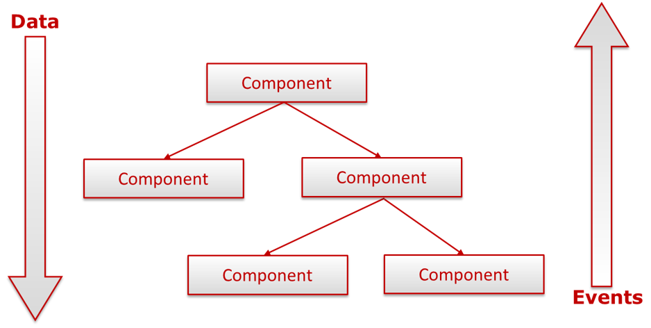
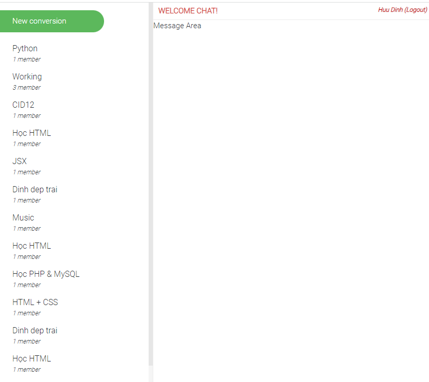
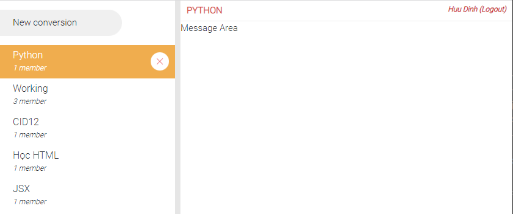
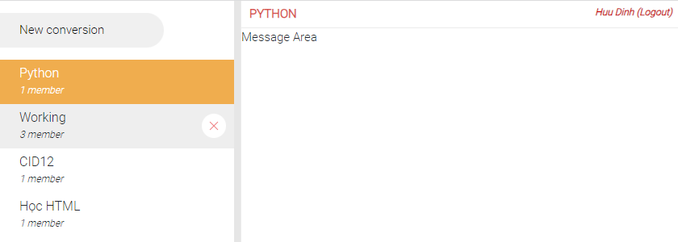
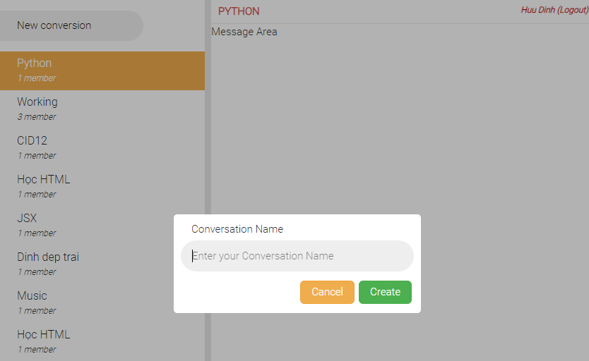

## Conversation List

### Mục Lục

- [1. Sửa file src/screen/Home/index.js](#1)
- [2. Sửa file src/screen/Home/Home.module.scss](#2)
- [3. Tạo file src/component/TitleBar/index.js](#3)
- [4. Tạo file src/component/TitleBar/TitleBar.module.scss](#4)
- [5. Sửa file src/component/SideBar/index.js](#5)
- [6. Sửa file src/component/SideBar/SideBar.module.scss](#6)
- [7. Sửa file src/component/ConversationItem/index.js](#7)
- [8. Sửa file src/component/ConversationItem/ConversationItem.module.scss](#8)
- [9. Sửa file src/component/ConversationModal/index.js](#9)
- [10. Sửa file src/component/ConversationModal/ConversationItem.module.scss](#10)
- [11. Sửa file src/component/Input/index.js](#11)


### Mục Tiêu

- Đọc và hiển thị danh sách các chủ đề từ Firestore
- Đếm số user tham gia chủ đề
- Xử lý logic active trang thái chủ đề được chọn theo kỹ thuật Data Down và Event Up
- Thay đổi tiêu đề hiển thị tương ứng đối với các chủ đề active 

### Kỹ Thuật

- Ý tưởng Component Tree: 
    + Có nhiều thành phần tạo nên một ứng dụng web. Các component lớn render các component nhỏ hơn, tạo thành một mô hình cây
    + Component tree giống với HTML DOM tree, được sử dụng để mô hình hoá giao diện ứng dụng.  

  

- Data Down:
    + Props chính là công cụ để giao tiếp từ component cha xuống component con
    + Data luôn di chuyển từ component cha xuống component con.

- Event up:
    + Props cho phép người dùng có thể truyền các dạng giá trị JS khác nhau từ component cha xuống component con, bao gồm cả các 'functions'. Chúng ta sẽ truyền xuống các function từ phía component cha xuống component con. Và các component con sẽ thực hiện chạy các function đó khi cần thiết.
    +  Sử dụng props để đưa các function đó xuống các component con
    +  Khi function được thực thi, state của component cha sẽ được cập nhật, dẫn tới cập nhật toàn bộ các component con.
- Luồng dữ liệu của React được luôn chuyển theo công thức: Data down - Events up


### Giao diện Create Conversation List

  

- Hiển thị danh sách conversation list mà user đang tham gia gồm tên conversation và số lượng member 

- Hiển thị tiêu đề 'Welcome chat' và tên user đã đăng nhập, khi click vào tên user chuyển ra màn hình đăng nhập

  

- Khi click vào từng chủ đề thì sẽ active vào củ đề đó, đồng thời thay đổi Tiêu đề ứng dụng

  

- Khi di chuột vào chủ đề thì hiển thị Icon để xóa chủ đề đó, tương tự với các chủ đề chưa được active

- Khi người dùng click vào Icon Xóa yêu cầu update nội dung vào danh sách chủ đề luôn mà ko cần F5 lại ứng dụng.

  

- Khi click vào New conversation yêu cầu active luôn vào Input để người dùng có thể gõ chủ đề luôn

- Khi nhập thông tin xong sau khi Enter hoặc người dùng click vào Create yêu cầu update nội dung vào danh sách chủ đề luôn mà ko cần F5 lại ứng dụng.


<a name="1"></a>
**1. Sửa file `src/screen/Home/index.js`**

```
import clsx from 'clsx';
import styles from './Home.module.scss';
import TitleBar from "../../components/TitleBar";
import SideBar from "../../components/SideBar";
import { useState } from 'react';

const Home = () => {
    const [conversation, setConversation] = useState({});
    const conversationActive = (conversation) => {
        setConversation(conversation)
    }

    return (
        <div className={clsx(styles.box)}>
            <SideBar conversationActive={conversationActive} />     
            <div className={clsx(styles.chatArea)}>
                <TitleBar conversation={conversation} />
                <div>
                    Message Area
                </div>
            </div>       
        </div>
    )
}

export default Home;
```

- Import thêm components TitleBar (lưu trữ chủ đề và link logout)
- CSS lại layout cho srceen Home (SideBar, TitleBar, Message Area)
- Sử dụng State conversation để lưu trữ thôn tin conversation đang được active
    + conversation đang active nhận được từ event của SideBar gửi lên qua function conversationActive
    + conversation đang active được truyền vào TitleBar để thay đổi chủ đề hội thoại

<a name="2"></a>
**2. Sửa file `src/screen/Home/Home.module.scss`**

```
.box{
    display:flex;
}
.chatArea{
    display: flex;
    flex-direction: column;
    flex:1;
}
```

<a name="3"></a>
**3. Tạo file `src/component/TitleBar/index.js`**

```
import clsx from 'clsx';
import styles from './TitleBar.module.scss';
import { signOut } from "firebase/auth";
import { auth } from "../../firebase";
import { useEffect, useState } from 'react';
import { useContext } from 'react';
import { AuthContext } from '../../context/AuthContext';

const TitleBar = (props) => {
    const [title, setTitle] = useState('WELCOME CHAT!');
    const {currentUser} = useContext(AuthContext);    

    useEffect(()=>{
        document.title = title;
        if(props.conversation.name !== ''){
            setTitle(props.conversation.name);
        } else{
            setTitle('WELCOME CHAT!');
        }
    })
    return (
        <div className={clsx(styles.box)}>
            <div className={clsx(styles.title)}>{title}</div>
            <div className={clsx(styles.logout)} onClick={() => signOut(auth)}>{currentUser.displayName} (Logout)</div>
        </div>
    )
}

export default TitleBar;
```
- Import các thư viện của firebase để có thể sử dụng hàm signOut để logout ra khỏi ứng dụng.

- Sử dụng `useContext` để lấy thông tin curentUser đã login vào hệ thống, lúc này ta có thể hiển thị tên của user đang login bằng lệnh `currentUser.displayName`

- Sử dụng useEffect để update title cho ứng dụng
    + Trường hợp conversation được active thì sẽ lấy thông tin title của conversation này
    + Trường hợp conversation ko active thì hiển thị 'Welcome Chat'

<a name="4"></a>
**4. Tạo file `src/component/TitleBar/TitleBar.modal.scss`**

```
.box{
    display: flex;
    justify-content: space-between;
    border-bottom: 1px solid #ececec;
    padding:5px 10px;
}
.title{
    color: #d9534f;
    text-transform: uppercase;
    font-weight: 600;
}
.logout{
    font-size: 12px;
    font-style: italic;
    cursor: pointer;
    margin-left: 5px;
    color: #c00;
    font-weight: 600;
    &:hover{
        text-decoration: underline;
    }
}
```

<a name="5"></a>

**5. Sửa file `src/component/SideBar/index.js`**

```
import clsx from 'clsx';
import styles from './SideBar.module.scss';
import ConversationModal from "../ConversationModal";
import ConversationItem from '../ConversationItem';
import { useState, useEffect } from 'react';
import { collection,where, getDocs, doc, deleteDoc } from "firebase/firestore";
import { db, auth } from "../../firebase";

const SideBar = (props) => {
    const [isConversation, setIsConversation] = useState(false);
    const [listConversationItem, setListConversationItem] = useState([]);
    const [conversation, setConversation] = useState({});
    const [conversationDeleteId, setConversationDeleteId] = useState();

    const handleClick = () => {
        setIsConversation(true);
    }

    const handeCancel = () => {
        setIsConversation(false);
    }

    const fetchPost = async () => {
        const querySnapshot = await getDocs(collection(db, "conversations"));
        querySnapshot.forEach((doc) => {
            // console.log(doc.id, doc.data());

            const users = doc.data().users;
            const currentUser = auth.currentUser.email;

            // Check User logged in conversation
            const checkUser = users.some((item) => item === currentUser)

            // Reset Title
            conversationActive({});

            // Update conversation of User Logged
             if(checkUser){
                setListConversationItem(prev => {
                    return [...prev, {id:doc.id, name:doc.data().name, users:doc.data().users.length}]
                });
            }
            
        });
    }
    useEffect(() => {
        fetchPost();
    },[]);

    // Get conversation actived information
    const conversationActive = (info) => {
        setConversation(info);
    }

    // Delete the document
    const handleDeleteConversation = (id) => {        
        // Delete coversation item UI
        const newListConversation = listConversationItem.filter((item) => {
            return item.id !== id
        });
        setListConversationItem(newListConversation);
        
        // Update Conversation Id Deleted
        setConversationDeleteId(id);

        // Delete conversation item Firestore
        const docRef = doc(db, "conversations", id);
        deleteDoc(docRef);
    }

    // Update ConversationActive to screen Home
    useEffect(()=>{
        if (conversation.id !== conversationDeleteId){
            props.conversationActive(conversation);
        } else {
            props.conversationActive({
                id: '',
                name: '',
            })
        }
    },[conversation, conversationDeleteId]);

    // Update New Conversation to UI
    const newConversationFnc = (topic) => {
        setListConversationItem(prev => {
			return [topic, ...prev]
		})
    }

    return (
        <div className={clsx(styles.box)}>
            <div className={clsx(styles.new)}>
                <button className={clsx(styles.button)} onClick={handleClick}>New conversion</button>
            </div>
            {isConversation && <ConversationModal handeCancel={handeCancel} newConversationFnc={newConversationFnc} />}
            <div className={clsx(styles.list)}>
                {listConversationItem.map((item) => {
                    return (
                        <ConversationItem
                            key={item.id}
                            active = {conversation.id === item.id ? "active" : undefined}
                            handleDeleteConversation = { handleDeleteConversation }
                            id={item.id} name={item.name} noOfUser={item.users} conversationActive={conversationActive} />
                    );
                })}
            </div>
        </div>
    )
}

export default SideBar;
```
- Component SideBar chứa những chức năng chính của Conversation List gồm có các chức năng:
    + Đọc danh sách conversation từ firestore
    + Xóa conversation
    + Kết nối TitleBar và Conversation New (Khi conversation New được tạo thì Conversation List được update và TitleBar được update) 
<a name="6"></a>

**6. Sửa file `src/component/SideBar/SideBar.module.scss`**

```
.box{
    width: 300px;
    height: 100vh;
    overflow: auto;
    border-right: 1px solid #ececec;
    display: flex;
    flex-direction: column;
    scrollbar-width: thin;
    scrollbar-color: #e6e6e6 #f5f5f5;
    &::-webkit-scrollbar-track {
        /* -webkit-box-shadow: inset 0 0 6px rgba(0, 0, 0, 0.1); */
        background-color: #f5f5f5;
    }
    &::-webkit-scrollbar {
        width: 8px;
        background-color: #f5f5f5;
    }
    &::-webkit-scrollbar-thumb {
        background-color: #e6e6e6;
    }
}
.list{
    display: flex;
    flex-direction: column;
    align-items: stretch;
}
.new{
    position: sticky;
    background: #fff;
    padding:15px 0;
    top:0;
    z-index: 10;
}
.button{
    width: 70%;
    padding: 10px 25px;
    font-size: 15px;
    text-align: left;
    margin:0;
    border-radius: 0 50px 50px 0;
    border:0;
    outline: none;
    cursor: pointer;
    transition: .3s;
    &:hover{
        background-color: #5cb85c;
        color:#fff;
    }
}
```
<a name="7"></a>

**7. Sửa file `src/component/ConversationItem/index.js`**

```
import clsx from 'clsx';
import styles from './ConversationItem.module.scss';

const ConversationItem = (props) => {
    const classes = clsx(styles.item,  {
        [styles.active]:props.active
    });

    const handleClick = () => {
        props.conversationActive({
            id: props.id,
            name: props.name,
        });
    }

    const handleDeleteConversation = () => {
        props.handleDeleteConversation(props.id);
    }

    return (
        <div className={classes}>
            <div className={clsx(styles.content)} onClick={handleClick} >
                <span>{props.name}</span>
                <span>{props.noOfUser} member</span>
            </div>
            
        </div>
    )
}

export default ConversationItem;
```
- Lấy thông tin (id, name) từ SideBar về qua Props bằng kỹ thuật (Data Down)
- Truyền Conversation Active khi component được click vào gồm có (ID, name) lên SideBar bằng kỹ thuật (Event Up)
- Truyền ID cần xóa lên SideBar bằng kỹ thuật (Event Up)
<a name="8"></a>

**8. Sửa file `src/component/ConversationItem/ConversationItem.module.scss`**

```
.item{
    line-height: 19px;
    cursor: pointer;
    position: relative;
    span:nth-child(1){
        font-size:16px;
        padding-bottom: 3px;
    }
    span:nth-child(2){
        font-size:12px;
        font-style: italic;
    }
    &:hover{
        background-color: rgb(238, 238, 238);
        .del{
            display: block;
        }
    }
    &.active{
        background-color: #f0ad4e;
        color: white;
        
    }
}
.content{
    display: flex;
    justify-content: space-between;
    flex-direction: column;
    padding:7px 25px;
}
.del{
    position: absolute;
    width: 30px;
    height: 30px;
    top:12px;
    right:10px;
    background-color: #fff;
    padding: 8px;
    border-radius: 100%;
    display: none;
    transition: .2s;
    &:hover{
        box-shadow: 0 0 8px rgba(0,0,0,.1);
        background-color: #fffbf6;
    }
}
```
<a name="9"></a>

**9. Sửa file file `src/component/ConversationModal/index.js`**

```
import clsx from 'clsx';
import styles from './ConversationModal.module.scss';
import Input from '../Input';
import Button from '../Button';
import { useState, useEffect } from "react";
import {useRef} from 'react';
import { collection, addDoc} from "firebase/firestore";
import { db, auth } from "../../firebase";

const ConversationModal = (props) => {
    const [formValues, setFormValues] = useState('');
    const [formErrors, setFormErrors] = useState({});
    const [isSubmit, setIsSubmit] = useState(false); 
    const boxRef = useRef(null);

    const handleChange = (e) => {
        const { name, value } = e.target;
        setFormValues({ ...formValues, [name]: value });
    }

    const createPost = async () => {
        const docRef = await addDoc(collection(db, "conversations"), {
            name: formValues.conversation,
            createBy: auth.currentUser.email,
            users: [auth.currentUser.email],
        });
        // console.log("Document written with ID: ", docRef);
     
        props.newConversationFnc({
            id:docRef.id,
            name: formValues.conversation,
            users: 1
        })
        props.handeCancel();
    }

    useEffect(() => {
        if(Object.keys(formErrors).length === 0 && isSubmit){
            createPost();

        }
    }, [formErrors]); 

    const handleSubmit = (e) => {
        e.preventDefault();
        setFormErrors(validate(formValues));
        setIsSubmit(true);
    }

    // Validate Input Conversation
    const validate = (values) => {
        const errors = {};

        if (!values.conversation) {
            errors.conversation = "Please type to create Conversation!";
        }

        return errors;
    }

    const handleCancelBox = (e) => {
        if(e.target == boxRef.current){
            props.handeCancel();
        }
    }

    const handleCancel = () => {
        props.handeCancel();
    }

    return (
        <div className={clsx(styles.box)} onClick={handleCancelBox} ref={boxRef}>
            <form onSubmit={handleSubmit}>
                <Input
                    default
                    label="Conversation Name"
                    name="conversation"
                    value={formValues.conversation}
                    onChange={handleChange}
                    error={formErrors.conversation}
                    autoFocus 
                />
                <div className={clsx(styles.footer)}>
                    <Button warning type="Button" handleClick={handleCancel}>Cancel</Button>
                    <Button success type="Submit" >Create</Button>
                </div>
            </form>
        </div>
    )
}

export default ConversationModal;
```

- Gửi thông tin conversation được thêm mới băng kỹ thuật Event Up qua function  props.newConversationFnc()

- Thêm props autoFocus vào input để con trỏ chuột focus vào ô input giảm thao tác người dùng

<a name="10"></a>

**10. Sửa file file `src/component/ConversationModal/ConversationItem.module.scss`**

```
.box{
    background-color: rgba(0,0,0,.3);
    position: fixed;
    top:0;
    left:0;
    width:100vw;
    height:100vh;
    display: flex;
    justify-content: center;
    align-items: center;
    z-index: 11;
    form{
        padding:10px;
        border-radius: 5px;
        background-color: #fff;
        width:350px;
    }
}
.footer{
    display: flex;
    justify-content: end;
    button{
        padding:4px 15px;
        border-radius: 6px;
    }
}
```
<a name="11"></a>

**11. Sửa file file `src/component/Input/index.js`**
```
import clsx from 'clsx';
import styles from './Input.module.scss';

function Input(props) {
    const classes = clsx(styles.input, {
        [styles.default]: props.default,
        [styles.primary]: props.primary,
        [styles.success]: props.success,
        [styles.info]: props.info,
        [styles.warning]: props.warning,
        [styles.danger]: props.danger,
        [styles.disabled]: props.disabled,
        // Add Class Error
        [styles.error]: props.error
    });

    const feedback = clsx(styles.feedback);

    return (
        <>
            <label htmlFor={props.name}>{props.label}</label>
            <input
                id={props.name}
                name={props.name}
                type={props.type}
                placeholder={'Enter your ' + props.label}
                value={props.value}
                onChange={props.onChange}
                onBlur={props.onBlur}
                className={classes}
                autoFocus={props.autoFocus}
            />
            {props.error && (
                <div className={feedback}>{props.error}</div>
            )}
        </>
    )
}
export default Input;
```
- Thêm thuộc tính autoFocus vào Input


*Bài tiếp theo [Màn hình Chat](/chat/lesson/chat.md)*
