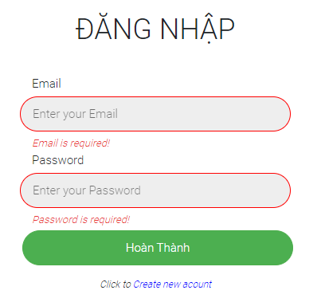

## Login & Regist Component / Login

### Mục Lục

- [1. Tạo component src/context/AuthContext.js](#1)
- [2. Sửa file src/index.js](#2)
- [3. Sửa file src/app.js](#3)
- [4. Tạo component src/screen/Login/index.js](#4)
- [5. Tạo component src/screen/Home/index.js](#5)


### Giao diện Login

  

- Validate Form Login, sử dụng component Input Button tương tự trang Register

- Kết nối với Firebase, thông báo lỗi khi tài khoản và mật khẩu đăng nhập không đúng

- Khi Logout không thể vào trang chính mặc định chuyển sang trang Login


<a name="1"></a>
**1. Tạo component src/context/AuthContext.js**
```
import { createContext, useEffect, useState } from "react";
import { auth } from "../firebase";
import { onAuthStateChanged } from "firebase/auth";

export const AuthContext = createContext();

export const AuthContextProvider = ({children}) => {
    const [currentUser, setCurrentUser] = useState({});

    useEffect(()=>{
        const unsub = onAuthStateChanged(auth, (user) => {
            setCurrentUser(user);
        })

        return () => {
            unsub();
        };
    }, []);

    return (
        <AuthContext.Provider value={{currentUser}}>
            {children}
        </AuthContext.Provider>
    );

};
```

- `Context`: Hoạt động giống như một kho dữ liệu, cung cấp dữ liệu cho các thành phần cần tới nó.

- `Context Provider`: một React component, sử dụng để cung cấp dữ liệu từ trong kho dữ liệu tới các component con.

- `Context Consumer`: một React component, được sử dụng để lấy dữ liệu từ trong kho context.

<a name="2"></a>
**2. Sửa file `src/index.js`**

```
import React from 'react';
import ReactDOM from 'react-dom/client';
import { BrowserRouter as Router } from 'react-router-dom';
import App from './App';
import { AuthContextProvider } from './context/AuthContext';

const root = ReactDOM.createRoot(document.getElementById('root'));
root.render(
  <AuthContextProvider>
    <Router>
      <App />
    </Router>
  </AuthContextProvider>
);
```
- Sử dụng Context để lưu trữ thông tin user khi user đăng nhập thành công

- `Context Provider` là một component của React. Nhiệm vụ của Provider là cho phép các component con được phép nhận sự thay đổi từ trong context. Context Provider nhận vào một props là value. Đây là giá trị mà tất cả các descendants nodes nằm trong provider có thể nhận được thông qua Context Consumer

<a name="3"></a>
**3. Sửa file `src/app.js`**
```
import { Routes, Route, Navigate } from 'react-router-dom';
import Home from './screen/Home';
import Login from './screen/Login';
import Register from './screen/Register';
import GlobalStyle from './components/GlobalStyles';
import { useContext } from 'react';
import { AuthContext } from './context/AuthContext';

function App() {
  const {currentUser} = useContext(AuthContext)
  const ProtectedRoute = ({children}) => {
    if(!currentUser){
      return <Navigate to="/login" />
    }
    return children;
  }
  
  return (
    <GlobalStyle>
      <div className="App">
        <Routes>
          <Route path='/'>
            <Route index element={<ProtectedRoute><Home /></ProtectedRoute>} />
            <Route path='login' element={<Login />} />
            <Route path='register' element={<Register />} />
            <Route path="*" element={<h1>Page not found</h1>} />
          </Route>
        </Routes>
      </div>
    </GlobalStyle>
  );
}

export default App;
```
- Kiểm tra xem nếu user chưa đăng nhập thì chuyển về màn hình Login

<a name="4"></a>

**4. Tạo component src/screen/Login/index.js**

```
import { Link, useNavigate } from 'react-router-dom';
import Input from "../../components/Input";
import Button from "../../components/Button";
import { useState, useEffect } from "react";
import { auth } from "../../firebase";
import { signInWithEmailAndPassword } from "firebase/auth";

function Login() {
    const intialValues = { username: "", email: "", password: "" };
    const [formValues, setFormValues] = useState(intialValues);
    const [formErrors, setFormErrors] = useState({});
    const [isSubmit, setIsSubmit] = useState(false);    
    const navigate = useNavigate();
    const [error, setError] = useState('');

    const handleChange = (e) => {
        const { name, value } = e.target;
        setFormValues({ ...formValues, [name]: value });
    }

    useEffect(() => {
        if(Object.keys(formErrors).length === 0 && isSubmit){
            // Call API
            const email = formValues.email;
            const password = formValues.password;
            // Sign in Firebase
            signInWithEmailAndPassword(auth, email, password)
                .then((userInfo)=>{
                    // console.log(userInfo);
                    navigate('/');
                })
                .catch((err)=>{
                    // console.log(err)
                    setError(err)
                })
        }
    }, [formErrors]);    
    
    const handleSubmit = (e) => {
        e.preventDefault();
        setFormErrors(validate(formValues));
        setIsSubmit(true);
    }

    const validate = (values) => {
        const errors = {};
        const regex = /^\w+([\.-]?\w+)*@\w+([\.-]?\w+)*(\.\w{2,3})+$/;

        if (!values.email) {
            errors.email = "Email is required!";
        } else if (!regex.test(values.email)) {
            errors.email = "This is not a valid email format!";
        }

        if (!values.password) {
            errors.password = "Password is required!";
        } else if (values.password.length <= 4) {
            errors.password = "Password must be more than 4 characters!" + values.password;
        }else if (values.password.length > 16) {
            errors.password = "Password cannot be more than 16 characters!";
        }

        return errors;
    }

    return (
        <div className="form">
            <h1 className="formTitle">ĐĂNG NHẬP</h1>
            {error != '' && <p className='formError'>Something went wrong</p>}
            <form onSubmit={handleSubmit}>
                <Input
                    default
                    label="Email"
                    name="email"
                    value={formValues.email}
                    onChange={handleChange}
                    error={formErrors.email}
                />
                <Input
                    default
                    label="Password"
                    name="password"
                    type="password"
                    value={formValues.password}
                    onChange={handleChange}
                    error={formErrors.password}
                />
                <Button success >Hoàn Thành</Button>
            </form>
            <p className="formLink">
                Click to <Link to="/register">Create new acount</Link>
            </p>
        </div>
    )
}

export default Login;
```

<a name="5"></a>

**5. Tạo component src/screen/Home/index.js**

```
import {signOut} from "firebase/auth";
import { auth } from '../../firebase';

const Home = () => {
    return (
        <div>
            <button onClick={()=>signOut(auth)}>logout</button>
        </div>
    )
}

export default Home;
```
- Tạo nút Logout, sử dụng phương thức signOut() để logout ra khỏi tài khoản đã đăng nhập.

*Bài tiếp theo [Màn hình Create Conversation](/chat/lesson/conversation.md)*
