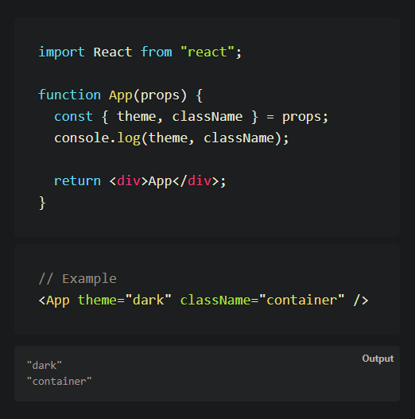

# QS1 Làm thế nào để Destructure Props trong Reactjs

Trong ReactJS, việc destructuring props giúp làm mã nguồn dễ đọc hơn và truy cập các thuộc tính của props một cách thuận tiện. Dưới đây là cách sử dụng destructuring props

### Destructuring một component duy nhất:

- Sử dụng export default để export một component duy nhất.
- Trong component, sử dụng destructuring để trích xuất các thuộc tính từ props. Ví dụ:

```
// MyClass.js
import React from 'react';

class MyClass extends React.Component {
    render() {
        const { name, age, height } = this.props; // Destructuring props
        return (
            <div>
                <p>Name: {name}</p>
                <p>Age: {age}</p>
                <p>Height: {height}</p>
            </div>
        );
    }
}

export default MyClass;

```

### Export nhiều components từ cùng một file:

Sử dụng các named exports để export nhiều components từ cùng một file. 

Ví dụ:

```
// AnotherComponent.js
export function A() {
    // ...
}
export function B() {
    // ...
}

```

### Import component đã export:

Để sử dụng component đã export, bạn có thể import chúng vào file khác. 

Ví dụ:

```
// App.js
import React from 'react';
import MyClass from './MyClass'; // Import default export
import { A, B } from './AnotherComponent'; // Import named exports

function App() {
    return (
        <div>
            <MyClass name="John" age={30} height="180cm" />
            <A />
            <B />
        </div>
    );
}

export default App;
```
Destructuring props giúp bạn truy cập các thuộc tính một cách dễ dàng và làm mã nguồn gọn gàng hơn. Chúc bạn thành công trong việc sử dụng ReactJS! 🚀