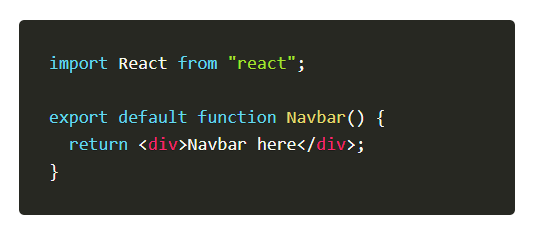

# Làm thế nào để Export Component trong Reactjs

Để export một component trong ReactJS, bạn có thể sử dụng các cách sau:

### Export một component duy nhất:

Sử dụng `export default` để export một component duy nhất. Ví dụ:

```
// MyClass.js
class MyClass extends React.Component {
    // ...
}
export default MyClass;

```

### Export nhiều components từ cùng một file:

Sử dụng các named exports để export nhiều components từ cùng một file. Ví dụ:

```
// AnotherComponent.js
export function A() {
    // ...
}
export function B() {
    // ...
}
```

### Import component đã export:

Để sử dụng component đã export, bạn có thể import chúng vào file khác. Ví dụ:

```
// App.js
import MyClass from './MyClass'; // Import default export
import { A, B } from './AnotherComponent'; // Import named exports
```

Nhớ kiểm tra đúng đường dẫn của file component và sử dụng cú pháp phù hợp cho việc import/export. Chúc bạn thành công trong việc xây dựng ứng dụng ReactJS! 🚀

