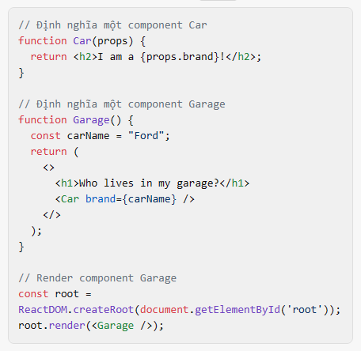

# Làm thế nào để get Props trong Reactjs

Trong ReactJS, props (viết tắt của properties) được sử dụng để truyền dữ liệu từ component cha xuống component con. Bạn có thể coi props như là các tham số của hàm trong JavaScript hoặc các thuộc tính trong HTML.

Dưới đây là một ví dụ về cách sử dụng `props` trong React:

```
// Định nghĩa một component Car
function Car(props) {
  return <h2>I am a {props.brand}!</h2>;
}

// Định nghĩa một component Garage
function Garage() {
  const carName = "Ford";
  return (
    <>
      <h1>Who lives in my garage?</h1>
      <Car brand={carName} />
    </>
  );
}

// Render component Garage
const root = ReactDOM.createRoot(document.getElementById('root'));
root.render(<Garage />);
```

Trong ví dụ trên, chúng ta định nghĩa một component Car nhận props là brand. 

Trong component Garage, chúng ta truyền props brand cho component Car.

Lưu ý rằng props trong React là read-only, tức là bạn không thể thay đổi giá trị của chúng. Nếu bạn cần thay đổi giá trị, hãy sử dụng state.

