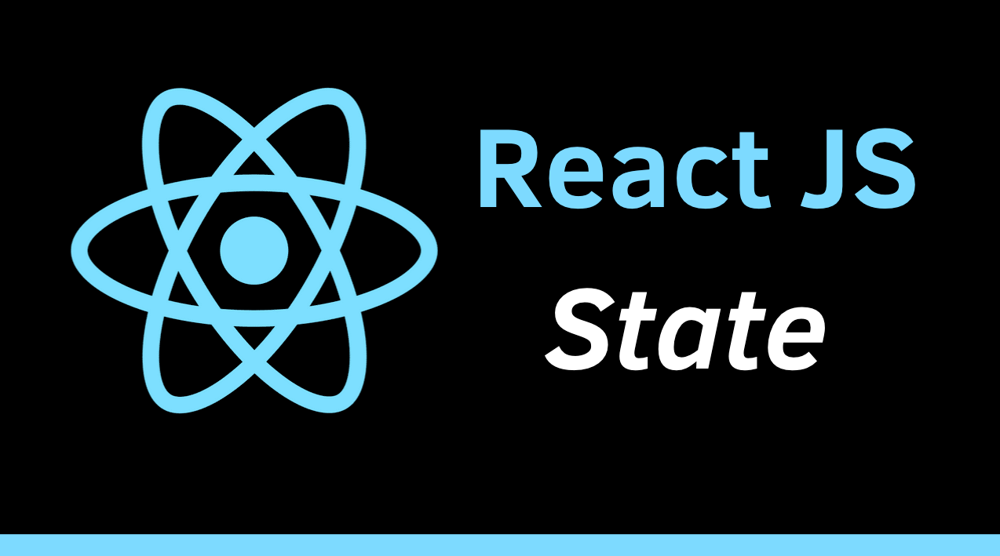

 

# RS30 Import State

### Tạo biến trạng thái

Để làm điều đó, chúng ta cần thêm hàm useState từ gói "react".

`useState` là một named export có cú pháp thêm là:

```
import {useState} from "react";
```

Nếu bạn đã thêm `React` vào trong cùng một file, bạn có thể kết hợp các lệnh import thành một lệnh import duy nhất. Ví dụ:

```
import React from "react";
import {useState} from "react";
```

2 câu lệnh có thể được kết hợp thành một lệnh import duy nhất:

```
import React, {useState} from "react";
```

### Lưu ý 

- `React` là default export (không có dấu ngoặc nhọn)
- `useState` là named export (được đóng gói trong dấu ngoặc nhọn)
- `useState` là một trong nhiều hook được cung cấp bởi React.

### Tóm lại

- `useState` cho phép tạo một biến trạng thái trong Component
- `useState` là một named export cần được thêm vào file JavaScript
- Bạn thêm `useState` và `React` vào file JavaScript bằng lệnh: `import React, {useState} from "react";`
- `useState` là một React hook.

### Bài tập

**Câu 1:** Chúng ta nên Import State ở đâu 

**Câu 2:** Có mấy cách để import State

*Bài tiếp theo [RS31 Khởi tạo State](/lesson/session/session_031_useState_more.md)*