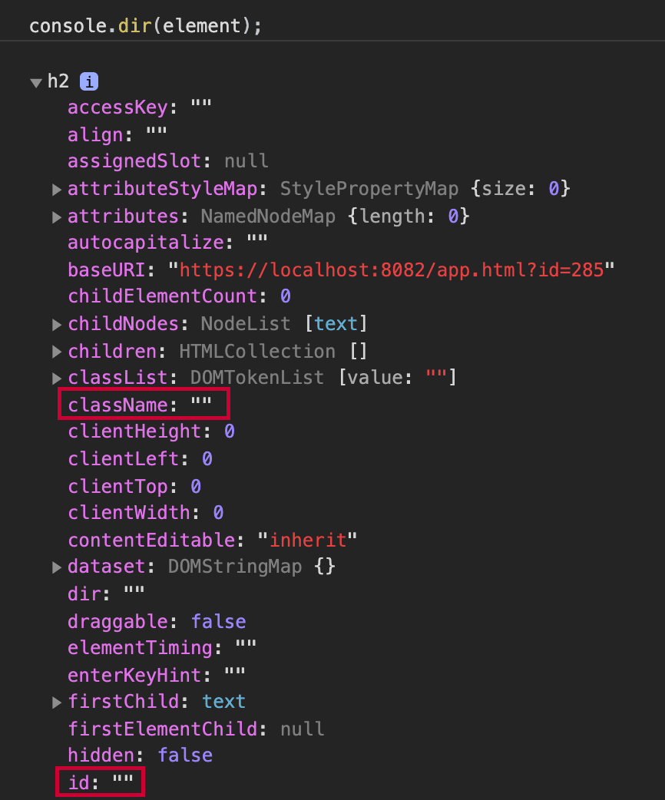

 

# RS3 Tạo phần tử HTML

`document.createElement(tagName)` là một Web API được các trình duyệt cung cấp để tạo một phần tử HTML.

### Cú pháp:

```
const element = document.createElement("h2");

// this creates: <h2></h2>
// which you can then insert in the DOM:
document.body.appendChild(element);
```

Hiện tại chúng ta chưa cần quan tâm đến việc chèn phần tử vào DOM, thay vào đó hãy tập trung vào `document.createElement()`.

Phương thức này tạo ra một phần tử HTML và chúng ta có thể xem tất cả các thuộc tính của đối tượng bằng cách sử dụng `console.dir(element)`, đây là một phương thức do các trình duyệt cung cấp để liệt kê tất cả các thuộc tính của một đối tượng cụ thể.

Ví dụ minh họa:

 

Bạn không cần sử dụng hầu hết các thuộc tính trong ảnh trên. Tuy nhiên, những thuộc tính quan trọng nhất xuất hiện trong danh sách đầy đủ là:

- id

- style

- className

### Thay đổi Class và style

```
const element = document.createElement("h2");
element.className = "name-of-class";
element.style = "color: red; background-color: blue";
```

Bạn có thể đang thắc mắc, tại sao chúng ta cần tạo phần tử HTML bằng JavaScript?

Bạn cần biết rằng việc tạo ra phần tử bằng JavaScript tương đương với việc tạo ra trực tiếp phần tử tương tự trong HTML, như ví dụ sau:

```
<h2 class="name-of-class" style="color: red; background-color: blue"></h2>
```

### Tạo nhiều class

Bạn có thể thiết lập nhiều class bằng cách phân tách tên lớp bằng khoảng trắng.

```
const element = document.createElement("h2");
element.className = "container center";
// <h2 class="container center"></h2>
```

### Thuộc tính className

Một điều quan trọng cần lưu ý ở đây là việc thay đổi `class` của phần tử diễn ra thông qua thuộc tính `className` chứ không phải `class`.

Điều đó là vì từ khóa `class` trong JavaScript là từ khóa dành riêng và được sử dụng để tạo một lớp JavaScript có thể gọi bằng cách sử dụng `new` (không phải là một lớp CSS).

Bạn cũng có thể thay đổi lớp bằng cách sử dụng `element.classList.add("name-of-class");` tuy nhiên, sau này bạn sẽ thấy rằng bạn cần tránh việc thay đổi DOM trực tiếp trong React (ví dụ: `classList.add`) và thay vào đó xác định các phần tử muốn hiển thị.

### Tóm lại

- `const element = document.createElement(tagName)` tạo một phần tử HTML

- `element.style = "background-color: blue"` đặt màu nền thành màu xanh lam

- `element.className = "container"` đặt lớp của phần tử thành: container

- Tạo nhiều lớp bằng cách phân tách tên lớp bằng khoảng trắng: `element.className = "container center"`

*Bài tiếp theo [RS4 React Element](/lesson/session/session_04_react_create_element.md)*
