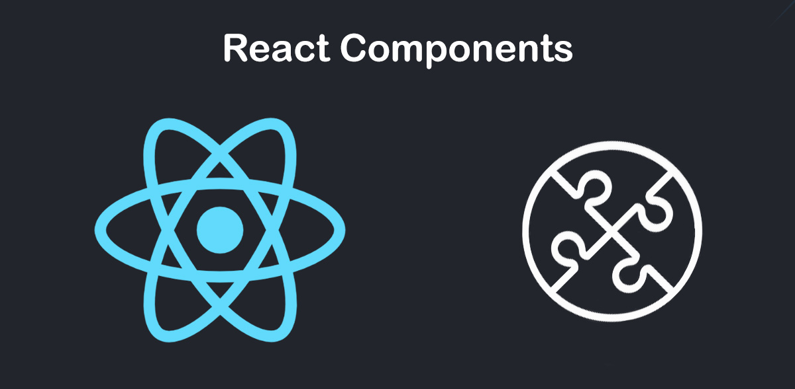

 

# RS42 Toán tử &&

Toán tử logic `&&` là cú pháp trong JavaScript cho phép bạn liên kết hai biểu thức với nhau.

Biểu thức thứ hai chỉ được thực thi khi biểu thức đầu tiên là true, ví dụ:

```
function getVotingMessage(age) {
    if (age >= 18) {
        return "You can vote";
    }
    return false;
}
```

Đoạn code có thể được viết lại như sau:

```
function getVotingMessage(age) {
    return (age >= 18) && "You can vote";
}
```

Khi `age >= 18` trả về `false`, biểu thức thứ hai (sau `&&`) sẽ KHÔNG được thực thi, vì vậy hàm trả về `false`.

Trong khi đó, khi `age >= 18` trả về `true`, biểu thức thứ hai sẽ được thực thi và `"You can vote"` được trả về từ hàm.

### Toán tử logic && trong JSX

Dưới đây là một ví dụ sử dụng toán tử trong JSX:

```
function Counter(props) {
    if (props.count > 99) {
        return <>
            <h1>You have {props.count} items</h1>
            <p>That is a lot of items.</p>
        </>;
    }
    return <h1>You have {props.count} items</h1>;
}

// Sample usage
const element = <Counter count={15} />;
```

Đoạn code có thể được viết lại như sau:

```
function Counter(props) {
    return <>
        <h1>You have {props.count} items</h1>
        {props.count > 99 && <p>That is a lot of items.</p>}
    </>;
}
```

Bây giờ, thẻ `<p>That is a lot of items.</p>` chỉ được hiển thị khi `props.count > 99` trả về true!

Lưu ý rằng đoạn code dưới đây sẽ không hoạt động như mong đợi khi `count` là 0:

```
function Counter(props) {
    return <>
        <h1>You have {props.count} items</h1>
        {props.count && <p>You have some items.</p>}
    </>;
}
```

Khi count là 0, 0 sẽ hiển thị trên màn hình. Điều đó là do props.count trả về 0, đó là một số, và React sẽ hiển thị nó vì nó là một số. Để code hoạt động như mong đợi, bạn cần cung cấp một biểu thức trả về một giá trị boolean (ví dụ: count > 0). React sẽ không hiển thị các giá trị boolean.

### Tóm lại

- Toán tử logic && là một tính năng của JavaScript được dùng để liên kết hai biểu thức. Biểu thức thứ hai chỉ được thực thi khi biểu thức đầu tiên trả về true.

- Sử dụng toán tử logic && trong JSX cho phép dễ dàng hiển thị các phần tử hoặc component theo điều kiện.

*Bài tiếp theo [RS43 Các nguyên tắc khi làm việc với Hooks](/lesson/session/session_043_hooks.md)*