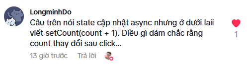

 

# RS66 Update State bằng Function

### Giải đáp câu hỏi `RS65 Cải thiện hiệu suất của ứng dụng`

 

`state cập nhật async nhưng ở dưới laii viết setCount(count + 1). Điều gì dám chắc rằng count thay đổi sau click... ?`

Câu hỏi cực kỳ tinh tế của bạn `LongminhDo`  React đúng là "async" trong cách cập nhật state, nhưng có một điểm thú vị ở đây: count trong setCount(count + 1) là giá trị hiện tại tại thời điểm render, chứ không phải giá trị "mới nhất" sau khi state được cập nhật.

#### Điều gì đang xảy ra ở setCount(count + 1)?

count + 1 được tính ngay khi hàm handleButtonClick chạy.

Giá trị count lúc này là giá trị hiện tại của state trước khi click.

React lên lịch (schedule) việc cập nhật state, nhưng không cập nhật tức thì.

Vì state cập nhật bất đồng bộ, bạn không thể chắc rằng count đã thay đổi sau khi gọi setCount() — bạn chỉ chắc chắn rằng lần render kế tiếp sẽ phản ánh giá trị mới.

#### Nếu có nhiều cập nhật liên tiếp thì sao?

Giả sử bạn viết như sau:

```jsx
setCounter(counter + 1);
setCounter(counter + 1);
```
Bạn kỳ vọng counter tăng 2 đơn vị. Nhưng do counter vẫn là giá trị cũ (chưa cập nhật kịp), React sẽ thực hiện hai lần setCounter(1) (ví dụ ban đầu là 0), dẫn đến kết quả chỉ tăng 1.

#### Giải pháp: dùng hàm callback

Để chắc chắn rằng bạn luôn cập nhật dựa trên giá trị mới nhất, hãy dùng dạng sau:

```jsx
setCounter(prevCount => prevCount + 1);

```
Cách này lấy giá trị mới nhất của counter, bất kể cập nhật trước đó đã xong hay chưa.


### Cập nhật State được gộp chung

Vì cập nhật trạng thái là hành vi bất đồng bộ, có một điều mà chúng ta cần phải để ý.

Để cho đơn giản, chúng ta sẽ xem xét component sau:

```jsx
import {useState} from "react";

function App() {
    const [counter, setCounter] = useState(0);

    function handleButtonClick() {
        setCounter(counter + 1);
        setCounter(counter + 1);
    }

    return <button onClick={handleButtonClick}>Click me {counter}</button>
}
```

Đây chỉ là code minh họa; tuy nhiên, code có hai lệnh gọi `setCounter` liên tiếp nhau.

Với đoạn code trên, bạn dự đoán giá trị của `counter` sẽ là bao nhiêu sau khi nhấp vào nút?

Giá trị sẽ là 1, không phải 2, lý do là:

```jsx
//assuming: counter is 0
setCounter(counter + 1);
setCounter(counter + 1);
```

Hai lần cập nhật trạng thái này sẽ được gộp chung và khi `counter = 0`, cuộc gọi `setCounter()` đầu tiên sẽ đặt giá trị của counter là` 0 + 1 = 1`, nhưng việc cập nhật này không xảy ra ngay lập tức vì nó là hành vi bất đồng bộ.

Khi gọi lần thứ hai `setCounter(counter + 1)`, giá trị của counter vẫn là 0 vì component chưa được hiển thị lại. Vì vậy, lần gọi thứ hai cũng sẽ cập nhật trạng thái thành 1.

Lưu ý rằng điều này xảy ra do các lần cập nhật trạng thái được gộp chung.

### Cập nhật State bằng hàm

Để giải quyết vấn đề này, React cung cấp khái niệm cập nhật state bằng hàm (functional state updates), đó là truyền một hàm vào hàm cập nhật trạng thái, dưới đây là một ví dụ:

```jsx
setCounter((previousCounter) => {
    return previousCounter + 1;
});
```

Phiên bản ngắn gọn hơn:

```jsx
setCounter(previousCounter => previousCounter + 1);
```

Chúng ta định nghĩa một hàm nhận giá trị trạng thái trước đó và trả về giá trị trạng thái mới. Trong ví dụ này, giá trị trạng thái mới là giá trị trạng thái trước đó + 1.

Dưới đây là cách bạn có thể sửa ví dụ trên để cộng vào trạng thái hai lần:

```jsx
import {useState} from "react";

function App() {
    const [counter, setCounter] = useState(0);

    function handleButtonClick() {
        setCounter(prevCounter => prevCounter + 1);
        setCounter(prevCounter => prevCounter + 1);
    }

    return <button onClick={handleButtonClick}>Click me {counter}</button>
}
```

Giá trị trạng thái counter sẽ tăng thêm 2 mỗi lần bạn nhấp vào nút.

Bạn có thể chưa hiểu rõ nguồn gốc của `prevCounter`. Hãy nhớ rằng `prevCounter => prevCounter + 1` là một định nghĩa hàm. React sẽ gọi hàm này và truyền giá trị trạng thái trước đó vào làm đối số đầu tiên.

Điều này có nghĩa là bạn có thể đặt tên đối số đó thành bất cứ điều gì bạn muốn. Trong ví dụ này, ta sử dụng `prevCounter`.

Để ý đoạn code đã tạo ra một vài bộ đếm. Chúng ta không gặp vấn đề với các component bộ đếm vì ứng dụng và component rất đơn giản và chỉ có một cập nhật trạng thái. Tuy nhiên, một khuyến nghị là:

Khi trạng thái mới được tính toán bằng cách sử dụng trạng thái trước đó, bạn nên sử dụng cập nhật trạng thái bằng hàm để đảm bảo tính nhất quán và ngăn ngừa lỗi không mong muốn.

Vì vậy, khi bạn cần tăng giá trị của bộ đếm thì nên sử dụng cập nhật trạng thái bằng hàm. Còn khi bạn muốn đặt lại bộ đếm về 0 thì không nhất thiết phải sử dụng cập nhật trạng thái bằng hàm (vì giá trị mới không được tính toán bằng cách sử dụng trạng thái trước đó).

### Tóm lại

- Hàm `setState` từ `useState` có thể nhận một hàm cho phép bạn thực hiện cập nhật trạng thái bằng hàm.
- Hàm được truyền cho `setState` nhận trạng thái trước đó làm đối số để tính toán trạng thái tiếp theo.
- Khi trạng thái mới được tính toán bằng cách sử dụng trạng thái trước đó, bạn nên sử dụng cập nhật trạng thái bằng hàm để đảm bảo tính nhất quán và ngăn ngừa lỗi không mong muốn.

### Bài tập

**Câu 1:** Tại sao cần update State bằng hàm


*Bài tiếp theo [RS67 useEffect](/lesson/session/session_067_effect.md)*