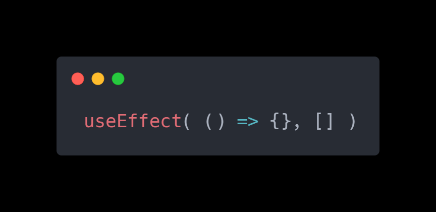

 

# RS67 useEffect

### React.StrictMode

React cung cấp component StrictMode giúp bạn tìm ra một số lỗi không mong muốn khi React đang chạy ở chế độ phát triển.

Bạn có thể giữ `StrictMode` khi chạy trong chế độ sản xuất vì nó không có tác động đến ứng dụng.

Thông qua đối tượng React, bạn có thể truy cập vào component `StrictMode`. Vì React là một đối tượng và `StrictMode` là một khóa của đối tượng đó, bạn có thể truy cập component đó bằng cách sử dụng cú pháp: `<React.StrictMode></React.StrictMode>` miễn là bạn đã thêm React vào file JavaScript.

Dưới đây là một ví dụ:

```jsx
import React from "react";
import {createRoot} from "react-dom/client";

function App() {
}

const root = document.querySelector("#root");

createRoot(root).render(<React.StrictMode><App /></React.StrictMode>);
```

Hoặc bạn có thể sử dụng cú pháp import để chỉ định rõ tên của component StrictMode khi bạn thêm nó vào file JavaScript:

```jsx
import {StrictMode} from "react";
import {createRoot} from "react-dom/client";

function App() {
}

const root = document.querySelector("#root");

createRoot(root).render(<StrictMode><App /></StrictMode>);
```

Strict mode sẽ giúp bạn tìm ra một tập hợp các lỗi vô tình được tạo ra khi sử dụng hook useEffect

### useEffect

Hook `useEffect` được dùng để triển khai hiệu ứng (effect) trong component.

Dưới đây là một số ví dụ về hiệu ứng:

- Gửi một yêu cầu đến nhà cung cấp dịch vụ phân tích
- Khởi tạo một plugin DOM ngoài React (ví dụ: vẽ bản đồ; sẽ được triển khai trong Dự án tiếp theo)
- Thay đổi tiêu đề trang (tiêu đề hiển thị trên thanh tab của trình duyệt)
- Đăng ký người dùng vào dịch vụ trò chuyện trực tiếp (với WebSockets)

Những hành động này được gọi là hiệu ứng vì chúng là các chỉ thị chạy bên ngoài component hoặc là kết quả của component.

Các hiệu ứng được sử dụng khi bạn cần đồng bộ hóa React với bất kỳ API bên ngoài nào. Ví dụ, thay đổi tiêu đề trang được coi là một API bên ngoài vì nó không được quản lý bởi React.

Bạn nên sử dụng hiệu ứng một cách cẩn thận và hạn chế.

Có hai loại hiệu ứng: hiệu ứng không yêu cầu dọn dẹp và hiệu ứng cần được dọn dẹp. 

### Áp dụng UseEffect cho thay đổi tiêu đề trang

Hãy bắt đầu với ví dụ đơn giản và phổ biến nhất về hiệu ứng cập nhật tiêu đề trang.

Trong JavaScript, bạn có thể cập nhật tiêu đề trang bằng cách thay đổi document.title, ví dụ:

```
document.title = "React Tutorial App";
```

Nếu bạn nhìn vào tiêu đề trang hiện tại trong trình duyệt, nó có thể là React Tutorial App. Bạn có thể cập nhật tiêu đề này với `document.title`.

Bây giờ, giả sử chúng ta có một component React và chúng ta muốn đồng bộ tiêu đề với trạng thái hiện tại; ví dụ, chúng ta có biến trạng thái counter và chúng ta muốn hiển thị giá trị của bộ đếm đó trong tiêu đề; cách thực hiện như sau:

```jsx
import {useState, useEffect} from "react";

function Counter() {
    const [counter, setCounter] = useState(0);

    useEffect(() => {
        document.title = `Counter is ${counter}`;
    });

    function handleButtonClick() {
        setCounter(prevCounter => prevCounter + 1);
    }
    
    return <button onClick={handleButtonClick}>Click me {counter}</button>
}
```

Đoạn code đã thêm useEffect vào file; cú pháp tương tự như khi thêm `useState`.

Dưới đây là cách chỉ thêm mỗi useEffect vào file (mà không có React và/hoặc useState):

```
import {useEffect} from "react";
```

Do đó, `useEffect` là một named export từ gói react.

Để ý `useEffect` đã nhận định nghĩa hàm làm đối số đầu tiên:

```
useEffect(() => {
    document.title = `Counter is ${counter}`;
});
```

Bây giờ hàm này:

```
() => {
    document.title = `Counter is ${counter}`;
}
```

sẽ được gọi sau mỗi lần hiển thị lại của component Counter.

Vì vậy, sau mỗi lần component Counter hiển thị (hoặc hiển thị lại), hàm trên sẽ được gọi, từ đó cập nhật tiêu đề trang.

Điều này cho phép bạn đồng bộ tiêu đề của tài liệu với giá trị `counter`.

### Tóm lại

- `<React.StrictMode />` giúp bạn tìm ra những lỗi không mong muốn khi React đang chạy ở chế độ phát triển.
- Strict mode của React không có tác động gì đến ứng dụng trong chế độ sản xuất.
- Hook useEffect được dùng để triển khai một hiệu ứng trong component.
- Cần sử dụng hiệu ứng khi bạn cần đồng bộ React với bất kỳ API bên ngoài nào.
- useEffect là một named export từ gói react.
- useEffect nhận định nghĩa hàm làm đối số đầu tiên, sẽ được chạy sau mỗi lần hiển thị lại của component đó.

*Bài tiếp theo [RS68 Các nguyên tắc khi làm việc với hooks](/lesson/session/session_068_effect_more.md)*