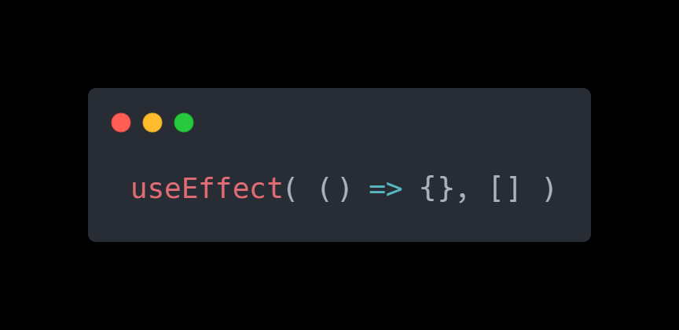

 

# RS71 Quản Lý Sự Kiện Window với React useEffect

Chúng ta đã học cách thêm trình lắng nghe sự kiện vào phần tử bằng thuộc tính JSX `onClick` (hoặc tương tự). Tuy nhiên, nếu bạn muốn thêm một trình lắng nghe sự kiện vào đối tượng window thì phải làm thế nào?

### Lắng nghe sự kiện trong Javascript

Để dọn dẹp sự kiện, chúng ta cần đặt tên cho hàm lắng nghe sự kiện

``` js
// we need to give a name to the event so that we can remove it later on
function handleWindowScroll(event) {
    console.log("page scrolled");
}

// call the handleWindowScroll function when the page is scrolled
window.addEventListener("scroll", handleWindowScroll, {passive: true});

// remove the event
window.removeEventListener("scroll", handleWindowScroll, {passive: true});
```

### Lắng nghe sự kiện trong React

Khi thực hiện hành động trên, ta đang tương tác với môi trường bên ngoài và điều này được coi là một hiệu ứng trong React. Điều đó là bởi vì khi component hiển thị, nó gây ra hiệu ứng phụ đến phần tử bên ngoài, đó là đối tượng window. Hiệu ứng phụ là thêm một trình lắng nghe sự kiện mới.

Điều này có thể hữu ích nếu bạn muốn biết khi nào người dùng cuộn trang để thực hiện một hành động nào đó.

Dưới đây là cách triển khai:

```jsx
import {useEffect} from "react";

function App() {
  useEffect(() => {
    window.addEventListener("scroll", () => {
        console.log("page scrolled");
    }, {passive: true});
  });

  return (<>
    <h2>List of products</h2>
    <p>Lorem ipsum...</p>
  </>);
}
```

> {passive: true} cải thiện đáng kể hiệu suất cuộn trên trang, nhưng nó ngăn bạn gọi `event.preventDefault()` bên trong trình xử lý cuộn. Đây không phải là một tính năng của React mà liên quan đến cách trình duyệt hoạt động.

Cách này hoạt động nhưng có một vấn đề lớn. Nó có thể dẫn đến rò rỉ bộ nhớ vì mỗi khi component App được hiển thị lại, chúng ta lại thêm một trình lắng nghe sự kiện mới.

Đây là lý do tại sao mỗi khi bạn gọi addEventListener bên trong useEffect, bạn cần dọn dẹp sau đó bằng cách gọi removeEventListener.


### Lắng nghe sự kiện cuộn (scroll)

Chúng ta cần trả về một hàm từ useEffect để dọn dẹp trình lắng nghe sự kiện này:

``` jsx
import React, { useEffect } from "react";

function App() {
  function handleWindowScroll(event) {
    console.log("page scrolled");
  }

  useEffect(() => {
    window.addEventListener("scroll", handleWindowScroll, { passive: true });

    // Dọn dẹp khi component unmount hoặc re-render
    return () => {
      window.removeEventListener("scroll", handleWindowScroll, { passive: true });
    };
  }, []); // 👈 Chạy một lần khi component mount

  return (
    <>
      <h2>List of products</h2>
      <p>Lorem ipsum dolor sit amet...</p>
    </>
  );
}
```

Component App bị hủy gắn kết (loại bỏ khỏi DOM) và mỗi khi nó được hiển thị lại, React sẽ dọn dẹp trình lắng nghe sự kiện để tránh rò rỉ bộ nhớ.

Lưu ý rằng nếu bạn muốn thêm sự kiện vào một phần tử được mô tả trong JSX, bạn vẫn phải sử dụng cú pháp onClick, onChange, v.v. Điều này chỉ áp dụng cho việc thêm sự kiện vào các đối tượng window, document hoặc các đối tượng bên ngoài React.

### Tóm lại

- Khi thêm một trình lắng nghe sự kiện bên ngoài React, hãy nhớ dọn dẹp nó.
- Bạn có thể dọn dẹp một trình lắng nghe sự kiện bằng cách sử dụng removeEventListener với hai đối số: loại sự kiện và tên của hàm xử lý sự kiện.

## Các Câu Hỏi Thường Gặp Khi Phỏng Vấn (FAQ)

### Câu 1: React Effect Hooks là gì và chúng hoạt động như thế nào?

React Effect Hooks, cụ thể là useEffect, cho phép bạn thực hiện các "hiệu ứng phụ" trong các component hàm. Hiệu ứng phụ là những hành động tương tác với môi trường bên ngoài React, chẳng hạn như truy cập API, thay đổi DOM trực tiếp, hoặc trong trường hợp này, thêm trình lắng nghe sự kiện vào các đối tượng ngoài React như window hoặc document. useEffect hoạt động bằng cách chạy một hàm bạn cung cấp sau khi mỗi lần render component, cho phép bạn thực hiện các tác vụ cần thiết bên ngoài luồng render chính của React.

### Câu 2: Tại sao việc thêm trình lắng nghe sự kiện vào đối tượng window lại được coi là một "hiệu ứng phụ" trong React?

Khi bạn thêm một trình lắng nghe sự kiện vào đối tượng window (hoặc document), bạn đang tương tác với môi trường bên ngoài của React. Component của bạn, khi render, tạo ra một tác động phụ lên một phần tử bên ngoài, đó là đối tượng window. Tác động phụ này là việc thêm một trình lắng nghe sự kiện mới. Điều này khác với việc thêm trình lắng nghe sự kiện vào các phần tử JSX (như onClick) vì các sự kiện đó được React quản lý trực tiếp bên trong hệ thống của nó.

### Câu 3: Tại sao việc không dọn dẹp trình lắng nghe sự kiện trong useEffect có thể dẫn đến rò rỉ bộ nhớ?

Nếu bạn thêm một trình lắng nghe sự kiện bên trong useEffect mà không dọn dẹp nó, mỗi khi component được render lại (ví dụ: khi trạng thái hoặc props thay đổi), một trình lắng nghe sự kiện mới sẽ được thêm vào. Các trình lắng nghe sự kiện cũ sẽ không bị xóa, dẫn đến nhiều bản sao của cùng một trình lắng nghe sự kiện tồn tại. Điều này gây lãng phí bộ nhớ và có thể dẫn đến các hành vi không mong muốn, chẳng hạn như trình xử lý sự kiện được kích hoạt nhiều lần cho một sự kiện duy nhất.

### Câu 4: Làm cách nào để dọn dẹp trình lắng nghe sự kiện trong useEffect?

Để dọn dẹp trình lắng nghe sự kiện, bạn cần trả về một hàm từ bên trong useEffect. Hàm trả về này sẽ được gọi khi component bị hủy gắn kết (unmount) và trước mỗi lần render lại component. Bên trong hàm trả về, bạn sẽ gọi removeEventListener với cùng các đối số (loại sự kiện và hàm xử lý sự kiện) mà bạn đã sử dụng khi gọi addEventListener. Việc này đảm bảo rằng trình lắng nghe sự kiện được gỡ bỏ đúng cách, ngăn chặn rò rỉ bộ nhớ.

### Câu 5: Khi nào tôi nên sử dụng useEffect để thêm trình lắng nghe sự kiện thay vì thuộc tính JSX như onClick?

Bạn nên sử dụng useEffect để thêm trình lắng nghe sự kiện khi bạn muốn lắng nghe các sự kiện trên các đối tượng bên ngoài React DOM, chẳng hạn như window, document, hoặc các phần tử được tạo ra bên ngoài luồng render của React. Đối với các phần tử được mô tả trực tiếp trong JSX, bạn nên tiếp tục sử dụng các thuộc tính JSX như onClick, onChange, onSubmit, v.v., vì React quản lý các trình lắng nghe sự kiện này một cách hiệu quả cho bạn.

*Bài tiếp theo [RS72 Dependencies trong useEffect](/lesson/session/session_072_effect_dependencies.md)*