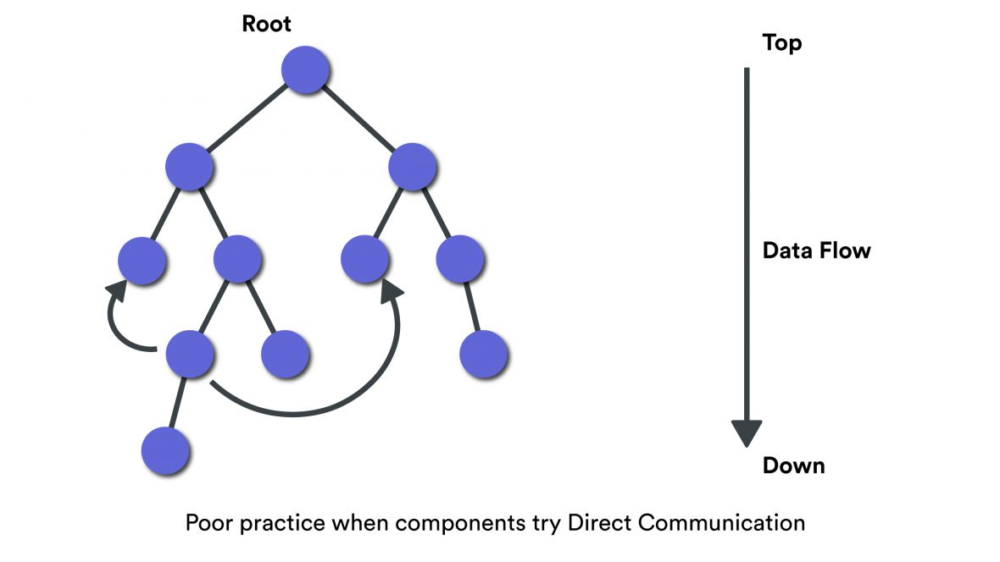

# Phần tử Root

 

Chúng ta sẽ đào sâu thêm về khái niệm phần tử root, còn được gọi là container.

Phần tử root mà bạn truyền cho ReactDOM sẽ được React quản lý hoàn toàn. Vì vậy, bạn không nên viết bất kỳ code JavaScript nào để thay đổi nội dung của nó.

Vì vậy, nếu bạn có:

```
<div id="react-root"></div>

import React from "react";
import {createRoot} from "react-dom/client";

const root = document.querySelector("#react-root");

createRoot(root)
    .render(
        React.createElement("h1", {}, "Hello World")
    );
```

Bạn không nên làm bất cứ điều gì với biến root và `<div id="react-root">...</div>` vì ReactDOM sẽ quản lý nó.

Chúng được quản lý bởi ReactDOM vì sau này bạn sẽ hiển thị những thứ phức tạp hơn phần tử có thể được cập nhật trong tương lai. Và ReactDOM sẽ chịu trách nhiệm cho việc cập nhật này.

### Những ứng dụng của React

React có hai ứng dụng chính; sau đây là cách chúng ảnh hưởng đến phần tử root:

#### Ứng dụng được xây dựng bằng React

Ứng dụng được xây dựng bằng React thường có một phần tử root duy nhất, giống như chúng ta sẽ thấy trong suốt khóa học này.

Toàn bộ ứng dụng được hiển thị bên trong phần tử root đó.

#### Tích hợp React vào Ứng dụng hiện có

Trang web có thể được xây dựng bằng một công nghệ khác ngoài React và sau đó tích hợp React để làm cho một phần cụ thể của trang web có khả năng tương tác với người dùng.

Ví dụ, bạn có trang web Siêu thị được xây dựng bằng Ruby on Rails hoặc Laravel và nếu bạn muốn làm cho tính năng giỏ hàng có thể tương tác với người dùng, bạn có thể sử dụng React để làm điều đó.

Trong trường hợp đó, logic của giỏ hàng sẽ nằm trong phần tử root `<div id="react-cart"></div>`.

Và ứng dụng có thể chứa nhiều hơn một phần tử root trong tương lai.

### Tóm lại

- ReactDOM quản lý hoàn toàn phần tử root

- Bạn không nên trực tiếp thay đổi/cập nhật nội dung của phần tử root

- Ứng dụng được xây dựng bằng React có một phần tử root duy nhất (Trường hợp sử dụng phổ biến nhất)

- Ứng dụng có thể tích hợp React để làm cho tính năng tương tác có nhiều hơn một phần tử root.


*Bài tiếp theo [JSX](/lesson/session/session_08_jsx.md)*
