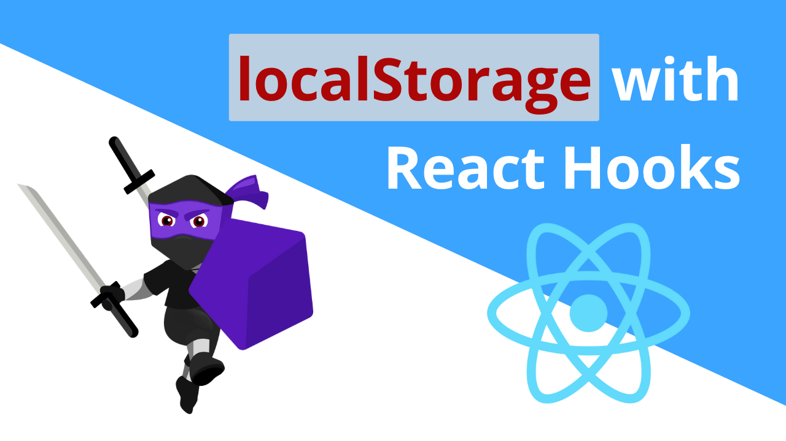

 

# RS81 Khôi phục trạng thái từ localStorage

Chúng ta đã thực hiện lưu trữ trạng thái của component trong localStorage.

Trong bài này, chúng ta sẽ tìm hiểu cách khôi phục trạng thái từ localStorage, có nghĩa là giá trị khởi tạo mà ta cung cấp cho `useState` sẽ đến từ localStorage.

Điều này cho phép bạn lưu trữ thiết lập cho chế độ tối. Vì vậy, nếu người dùng chọn chế độ tối và quay trở lại trang web trong tương lai, trang sẽ vẫn ở chế độ tối vì chúng ta đã lưu trữ giá trị đó trong localStorage.

Chúng ta sẽ cùng tìm hiểu cách đọc giá trị được lưu trữ trong localStorage, cách làm có chút khác biệt tùy thuộc vào kiểu dữ liệu được lưu trữ.

### Chuỗi

Đọc chuỗi từ localStorage là lựa chọn đơn giản nhất vì localStorage lưu trữ mọi thứ dưới dạng chuỗi.

```
localStorage.getItem("key-here");
```

### Số

Bởi vì localStorage luôn trả về chuỗi, chúng ta cần chuyển đổi chuỗi thành số một cách thủ công:

```
let value = localStorage.getItem("key-here");
value = Number.parseInt(value, 10); // convert to number
```

Bạn cũng có thể sử dụng `Number.parseFloat (value, 10)` nếu muốn hiển thị phần thập phân (ví dụ: 12.5).

Số 10 chính là đối số thứ hai, gọi là cơ số.

### Boolean

Giá trị `boolean` có thể là `true` hoặc `false`. Khi được lưu vào localStorage, chúng sẽ là `"true"` hoặc `"false"` (vì chúng được chuyển đổi thành chuỗi).

Cách chuyển đổi chuỗi trở lại thành `boolean` đơn giản nhất là so sánh mục trong localStorage với chuỗi `"true"`; sau đây là lý do:

```
"true" === "true" // true (means original value was true)
"false" === "true" // false (means original value was false)
```

Dưới đây là cách viết khi đọc từ localStorage:

```
const value = localStorage.getItem("key-here") === "true";
```

Bằng cách so sánh với chuỗi `"true"`, bạn đang chuyển đổi giá trị từ chuỗi thành kiểu `boolean`.

### Giá trị mặc định

Khi bạn đọc một khóa chưa được lưu trữ trong localStorage, kết quả sẽ trả về giá trị `null`.

Bạn có thể đặt giá trị mặc định cho biến theo nhiều cách như câu lệnh if, toán tử ba ngôi hoặc toán tử 3 ngôi (??). Dưới đây là một số ví dụ gán giá trị mặc định là mảng rỗng:

```
// using an if condition
let value = []; // default value
if (localStorage.getItem("key-here")) {
    value = localStorage.getItem("key-here");
}

// OR: using the ternary operator
const value = localStorage.getItem("key-here") !== null ? localStorage.getItem("key-here") : [];

// OR: using the nullish coalescing operator
const value = localStorage.getItem("key-here") ?? [];
```

Chúng ta cần đặt giá trị mặc định cho mảng nếu mong đợi localStorage trả về mảng. Điều này đảm bảo rằng việc gọi `.map()` hoặc các phương thức mảng khác sẽ không gây lỗi nếu `localStorage.getItem()` trả về `null`.

### Tóm lại

- Đọc chuỗi từ localStorage là lựa chọn đơn giản nhất vì localStorage lưu trữ mọi thứ dưới dạng chuỗi
- Đối với số, chúng ta cần chuyển đổi từ chuỗi sang số bằng cách sử dụng `Number.parseInt ("string", 10)`
- Đối với giá trị `boolean`, chúng ta cần so sánh với chuỗi `"true"` để  chuyển đổi thành giá trị boolean tương ứng.


*Bài tiếp theo [RS82 Tối ưu hiệu suất khi sử dụng LocalStorage](/lesson/session/session_082_localStorage_lazy_state.md)*