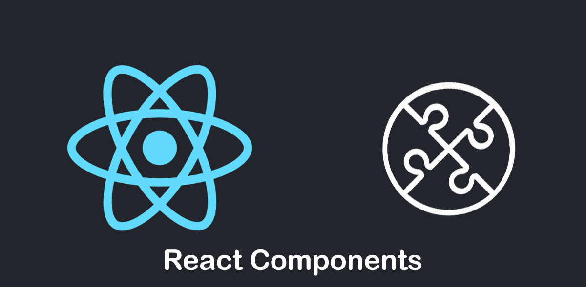

 

# RS56 Controlled component

### Controlled component là gì?

Controlled component là khi bạn theo dõi giá trị của một `input` dưới dạng `state` và cập nhật giá trị mỗi khi nó thay đổi.

Việc sử dụng controlled component là rất hữu ích trong các trường hợp có thẻ `<input />` (hoặc các thẻ `<select />` hoặc `<textarea />`) vì nó cho phép bạn lấy giá trị do người dùng viết và tự động thay đổi giá trị khi trạng thái thay đổi.

Cách tạo một controlled component:

1. Bắt đầu bằng việc tạo biến state để lưu trữ giá trị
2. Biến sẽ có giá trị mặc định là một chuỗi rỗng ""
3. Thiết lập giá trị của input là biến state đó
4. Cập nhật state mỗi khi nó thay đổi

```
import {useState} from "react";

function App() {
    const [address, setAddress] = useState("");

    return <input type="text" value={address} onChange={event => setAddress(event.target.value)} />;
}
```

Hãy xem lại các bước:

1. Chúng ta bắt đầu bằng việc tạo biến trạng thái address
2. Gán giá trị mặc định là `""`
3. Thiết lập giá trị của `<input />` bằng `value={address}`
4. Cập nhật biến `state` mỗi khi giá trị thay đổi: `onChange={event => setAddress(event.target.value)}`

Bây giờ mỗi khi người dùng thay đổi nội dung của trường nhập liệu, bạn có thể nhận được phiên bản mới nhất bằng cách truy cập vào biến `state address`.

Và nếu bạn muốn thay đổi giá trị của `address` thành giá trị khác, hãy gọi `setAddress("..")` và cập nhật giá trị của trường nhập liệu.

Đây chính là Controlled Component!

### Cung cấp giá trị mặc định

Để lấy một giá trị mặc định khác chuỗi rỗng, bạn có thể cập nhật giá trị mặc định của `useState`:

```
import {useState} from "react";

function App() {
    const [address, setAddress] = useState("Amsterdam");

    return <input type="text" value={address} onChange={event => setAddress(event.target.value)} />;
}
```

Bạn không cần sử dụng thuộc tính `defaultValue` nữa vì đây là một `controlled component`.

### Tóm lại

- Controlled component là khi bạn theo dõi giá trị của một `input` dưới dạng `state` và cập nhật giá trị mỗi khi nó thay đổi.
- Để kiểm soát một trường nhập liệu, bạn cần gán giá trị của nó cho một biến `state` và cập nhật biến `state` đó mỗi khi trường nhập liệu thay đổi.
- Controlled component là sự kết hợp của `value={state}` và `onChange={event => setState(event.target.value)}`

*Bài tiếp theo [Form Submit](/lesson/session/session_57_form_submit.md)*