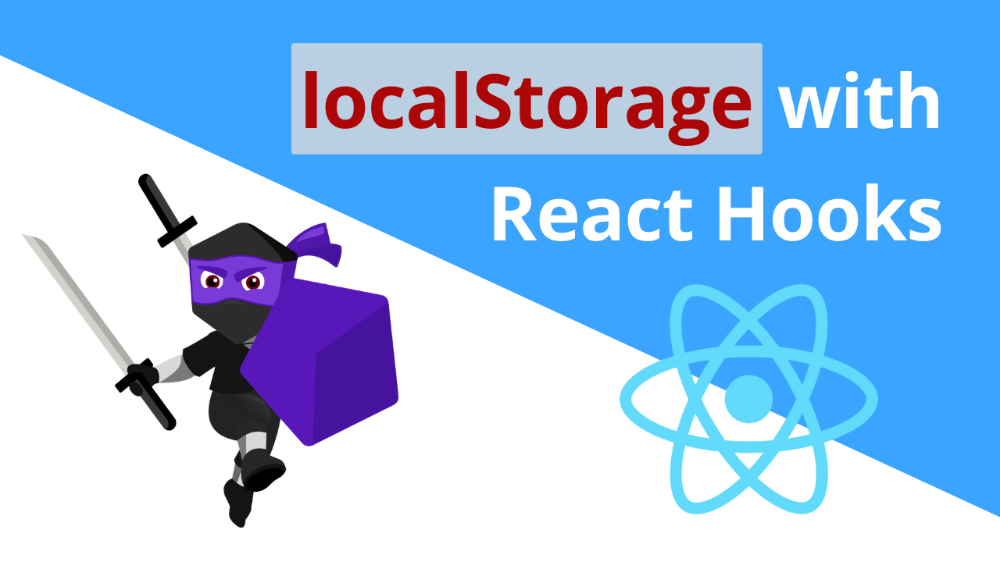

 

# RS82 Lazy initial state

Về mặt lý thuyết, việc khôi phục dữ liệu từ localStorage cũng đơn giản như việc thay thế giá trị khởi tạo trong useState bằng một cuộc gọi đến localStorage, ví dụ:

```
import {useState} from "react";

function App() {
    // do NOT use this (for performance reasons)
    const [state, setState] = useState(localStorage.getItem("some-state"));
}
```

Đoạn code trên hoạt động bình thường nhưng có vấn đề về hiệu suất.

Việc gọi hàm `localStorage.getItem("some-state")` tốn rất nhiều thời gian và chúng ta chỉ cần sử dụng nó để khởi tạo trạng thái ban đầu. Tuy nhiên, mỗi khi component App được hiển thị lại, dòng lệnh `localStorage.getItem("some-state")` sẽ chạy ngay mặc dù chúng ta KHÔNG cần giá trị đó nữa.

### Lazy initial state (Trạng thái khởi tạo trễ)

Trạng thái khởi tạo trễ có thể giúp khắc phục vấn đề này. Nó cho phép bạn truyền một định nghĩa hàm thay vì biểu thức, từ đó cho phép React chỉ gọi hàm đó trong lần hiển thị ban đầu.

Dưới đây là cách triển khai:

```
import {useState} from "react";

function App() {
    // use this 👍
    const [state, setState] = useState(() => localStorage.getItem("some-state"));
}
```

Hãy so sánh đoạn code trước/sau khi sử dụng `useState` để thấy sự khác biệt tuy rất nhỏ nhưng có thể ảnh hưởng đến hiệu suất ứng dụng:

```
// before
const [state, setState] = useState(localStorage.getItem("some-state"));
// after
const [state, setState] = useState(() => localStorage.getItem("some-state"));
```

Sự khác biệt giữa hai cách triển khai là trước đó chúng ta sử dụng biểu thức: `localStorage.getItem ("some-state")` còn trong cách triển khai sau, chúng ta sử dụng hàm: `() => localStorage.getItem ("some-state")`.

Việc sử dụng hàm này cho phép React chỉ gọi hàm cần thiết để lấy giá trị của trạng thái khởi tạo 1 lần, điều này sẽ không gây ra vấn đề về hiệu suất.

Vì vậy, nếu so sánh thì phương pháp đầu tiên (cách chậm hơn) là sử dụng một biểu thức chạy mỗi lần (vì React không thể tự quyết định việc bỏ qua một biểu thức). Ngược lại, phương pháp thứ hai (cách nhanh hơn) là sử dụng một hàm chỉ chạy một lần duy nhất. Khi bạn cung cấp một định nghĩa hàm, React chỉ chạy nó một lần duy nhất trong quá trình khởi tạo.

Hàm được sử dụng trong ví dụ trên là một arrow function giá trị trả về ngầm định nhưng bạn có thể sử dụng bất kỳ kiểu hàm nào bạn muốn miễn là nó trả về giá trị cho state khởi tạo. Ví dụ trên có thể được viết lại như sau:

```
// Also valid
const [state, setState] = useState(() => {
    return localStorage.getItem("some-state")
});
//Also valid
const [state, setState] = useState(function() {
    return localStorage.getItem("some-state")
});
```

### Khôi phục mảng và đối tượng

Hãy nhớ rằng chúng ta có thể xử lý mảng và đối tượng theo cách tương tự nhau và chúng ta cần chuyển đổi mảng và đối tượng thành chuỗi trước khi lưu vào localStorage.

Điều này có nghĩa là khi chúng ta muốn đọc lại giá trị của đối tượng từ localStorage, chúng ta cần parse chuỗi trở lại thành đối tượng.

Dưới đây là cách thực hiện:

```
import {useState, useEffect} from "react";

function App() {
    const [array, setArray] = useState(() => {
        return JSON.parse(localStorage.getItem("key-here"));
    });

    useEffect(() => {
        localStorage.setItem("key-here", JSON.stringify(array));
    }, [array]);
}
```

Đoạn code có thể được viết lại bằng cách sử dụng trả về ngầm định:

```
const [array, setArray] = useState(() => JSON.parse(localStorage.getItem("key-here")));
```

### Tóm lại

- Trạng thái khởi tạo trễ giúp tránh các vấn đề về hiệu suất khi việc tính toán giá trị ban đầu cho trạng thái có thể tốn nhiều thời gian và tài nguyên.
- Trạng thái khởi tạo trễ hoạt động bằng cách xác định một hàm trả về trạng thái khởi tạo thay vì biểu thức. Điều này cho phép React chỉ gọi hàm đó một lần duy nhất.
- Khi đọc mảng và đối tượng từ localStorage, chúng ta cần phân tích chúng trở lại thành đối tượng với `JSON.parse(string)`.


*Bài tiếp theo [RS83 Promises](/lesson/session/session_83_promises.md)*