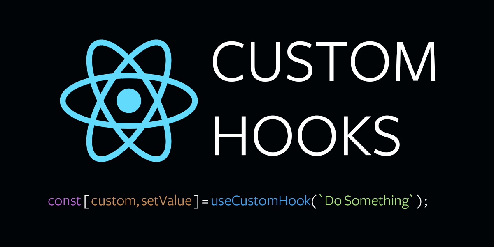

 

# RS96 Custom Hooks

Chúng ta đã tìm hiểu về những hook được cung cấp bởi React `useState`, `useEffect`. Ngoài ra, React còn cung cấp một số hook khác. Tuy nhiên, điều thú vị là bạn có thể xây dựng các hook tùy chỉnh (custom hook) của riêng mình.

### Dữ liệu bên trong body sẽ được lấy từ một biến trạng thái

### Tóm lại

- 

*Bài tiếp theo [RS97 Custom Hooks](/lesson/session/session_97_custom_hooks.md)*