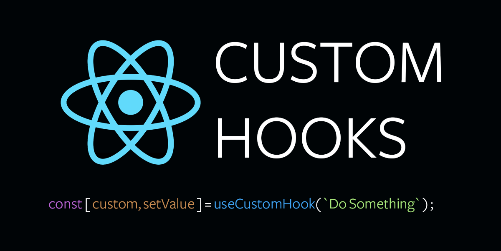

 

# RS98 Di chuyển hooks vào file riêng

Mục tiêu của hook tùy chỉnh là tái sử dụng hook trong nhiều component. Việc đặt chúng vào một file riêng cũng giúp mã nguồn dễ đọc và dễ quản lý hơn. 

Để làm cho mã nguồn gọn gàng và dễ đọc hơn, hãy đặt tên file chứa hook tùy chỉnh là: [useSomething].js, hãy thay thế [useSomething] bằng tên hook của bạn.

Ví dụ, hãy xem xét hook tùy chỉnh sau:

```
import {useEffect} from "react";

function useHelloWorld() {
    useEffect(() => {
        console.log("Hello World!");
    });
}
```

Ở đây ta nên đặt tên là `useHelloWorld.js`.

Khi ta đặt hàm vào một file riêng, ta cần xuất nó ra để có thể sử dụng trong các file khác.

Giống như khi làm việc với nhiều component, bạn cần `export default` hàm hook. Vì vậy, hook tùy chỉnh trở thành:

```
// useHelloWorld.js
import {useEffect} from "react";

export default function useHelloWorld() {
    useEffect(() => {
        console.log("Hello World!");
    });
}
```

### Có hai điều cần lưu ý:

1. Đầu tiên chúng ta thêm `useEffect` vào file này vì chúng ta sẽ sử dụng nó trong hook tùy chỉnh.
2. Sau đó ta `export default` hàm hook tùy chỉnh để có thể thêm nó vào các file khác.

Bây giờ, quay trở lại component `App`, chúng ta có thể thêm nó vào như sau:

```
import useHelloWorld from "./useHelloWorld.js";

function App() {
    useHelloWorld();

    return <h1>My App</h1>;
}
```

Code ngắn gọn hơn vì chúng ta có hook nằm trong file riêng của nó và chúng ta có thể thêm và sử dụng nó trong bất kỳ component nào khác.

Bạn cũng có thể đặt tên file là useHelloWorld.hook.js để chỉ rõ rằng đây là một hook tùy chỉnh. Điều này phụ thuộc vào bạn.

### Tóm lại

- Hãy đặt tên cho hook là `[useSomething].js`, thay thế `[useSomething]` bằng tên hook của bạn.
- Nhớ thêm `useEffect` (hoặc các hook React khác) mà bạn định sử dụng vào file định nghĩa hook tùy chỉnh.
- Bạn cần `export default` hook tùy chỉnh để có thể thêm nó vào các file khác.

*Bài tiếp theo [RS99 Di chuyển hooks vào file riêng](/lesson/session/session_99_custom_hooks_file.md)*